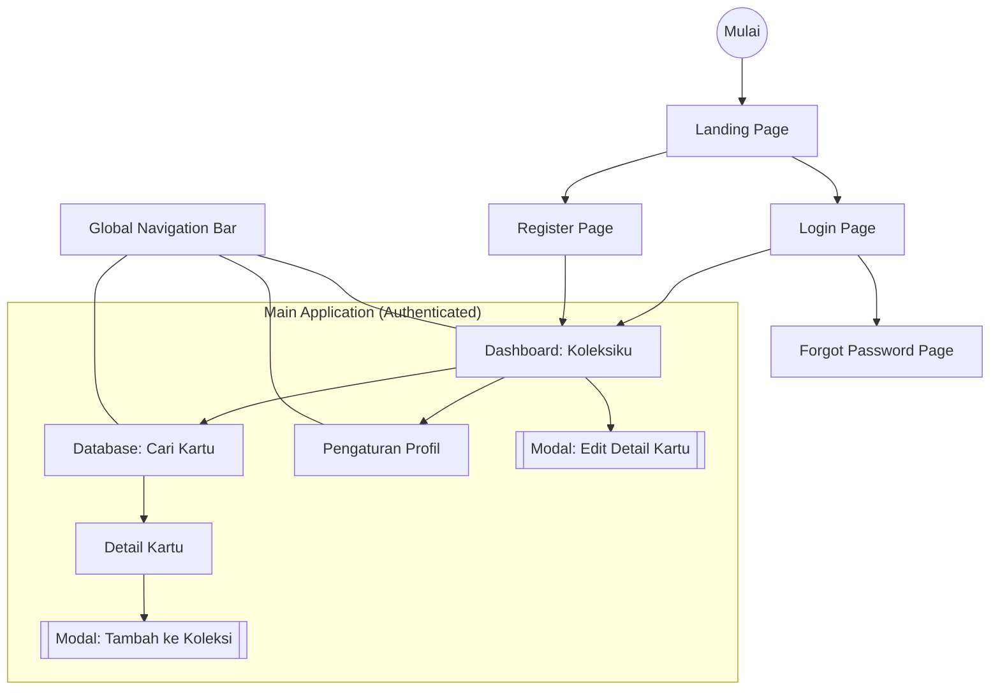

## Change Log

| Versi | Tanggal | Author | Perubahan |
|---|---|---|---|
| v1.0 | 2026-05-13 | Eka Dwi Ramadhan | Initial Sitemap & Information Architecture |
| v1.1 | 2026-05-13 | Eka Dwi Ramadhan | Update Data Grouping Strategy: tambah catatan skalabilitas grouping per tcg_type (Phase 3+) dan item baru Database Card Browser (Phase 3+) |

---

# Sitemap & Information Architecture: ArkaDex

## Overview

Dokumen ini memvisualisasikan hierarki halaman dan struktur navigasi aplikasi ArkaDex (MVP) untuk memastikan pengalaman pengguna dengan akses maksimal 3 klik ke fitur utama.

---

## Navigation Map (Sitemap)

---

## Navigation Structure & Components

### 2.1. Global Navigation

Berfungsi sebagai jangkar utama pengguna untuk berpindah antar fitur inti.

| Menu | Tujuan | Prioritas | Tampilan |
| :--- | :--- | :--- | :--- |
| **Koleksiku** | Dashboard utama, daftar kartu dimiliki | High | Ikon Buku (Bentuk Tab Aktif Default) |
| **Database** | Pencarian kartu baru | High | Ikon Kaca Pembesar |
| **Profil** | Pengaturan username & logout | Low | Ikon Orang / Inisial User |

### 2.2. URL Structure (Web Routing)

Untuk memudahkan tim developer dalam pengaturan *routing* (misalnya menggunakan React Router atau Next.js):

- `/` : Landing Page
- `/auth/login` : Halaman Login
- `/auth/register` : Halaman Registrasi
- `/dashboard` : Koleksiku (Home)
- `/database` : Pencarian Kartu
- `/database/:cardId` : Detail Kartu (Opsional, bisa berupa modal)
- `/profile` : Pengaturan Profil

---

## Data Grouping Strategy

Untuk mengoptimalkan scannability (kemampuan memindai informasi cepat) pada layar mobile:

1. **Dashboard (Koleksiku):** Data dikelompokkan berdasarkan Set TCG (misalnya: Scarlet ex, Violet ex). Pengguna dapat melakukan collapse/expand pada setiap grup set. Pada MVP, pengelompokan dilakukan per Set Pokemon TCG Indonesia. Struktur grouping ini dirancang untuk mendukung pengelompokan per `tcg_type` di Phase 3+ (misalnya: Pokemon TCG, One Piece TCG, Digimon TCG) tanpa perubahan pada pola navigasi utama.

2. **Database:** Hasil pencarian ditampilkan dalam infinite scroll atau pagination untuk mencegah beban loading yang berat.

3. **Database Card Browser (Phase 3+):** Saat multi-TCG diaktifkan, halaman Database akan menampilkan filter tambahan: "TCG Type" (Pokemon/One Piece/Digimon) dan "Language Edition" (Indonesia/Jepang/Inggris) sebelum filter Set. Untuk MVP, filter ini tidak ditampilkan karena hanya ada satu TCG dan satu bahasa.

---

## Next Steps

Sitemap ini melengkapi seluruh dokumentasi desain ArkaDex. Langkah selanjutnya adalah memulai inisialisasi project untuk menerjemahkan arsitektur informasi ini ke dalam kode.
