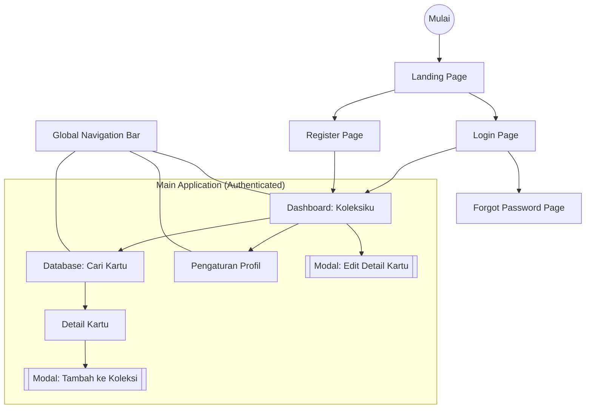

# Sitemap & Information Architecture: ArkaDex

## Overview

Dokumen ini memvisualisasikan hierarki halaman dan struktur navigasi aplikasi ArkaDex (MVP) untuk memastikan pengalaman pengguna dengan akses maksimal 3 klik ke fitur utama.

---

## Navigation Map (Sitemap)

---

## Navigation Structure & Components

### 2.1. Global Navigation

Berfungsi sebagai jangkar utama pengguna untuk berpindah antar fitur inti.

| Menu | Tujuan | Prioritas | Tampilan |
| :--- | :--- | :--- | :--- |
| **Koleksiku** | Dashboard utama, daftar kartu dimiliki | High | Ikon Buku (Bentuk Tab Aktif Default) |
| **Database** | Pencarian kartu baru | High | Ikon Kaca Pembesar |
| **Profil** | Pengaturan username & logout | Low | Ikon Orang / Inisial User |

### 2.2. URL Structure (Web Routing)

Untuk memudahkan tim developer dalam pengaturan *routing* (misalnya menggunakan React Router atau Next.js):

- `/` : Landing Page
- `/auth/login` : Halaman Login
- `/auth/register` : Halaman Registrasi
- `/dashboard` : Koleksiku (Home)
- `/database` : Pencarian Kartu
- `/database/:cardId` : Detail Kartu (Opsional, bisa berupa modal)
- `/profile` : Pengaturan Profil

---

## Data Grouping Strategy

Untuk mengoptimalkan scannability (kemampuan memindai informasi cepat) pada layar mobile:

1. **Dashboard (Koleksiku):** Data dikelompokkan berdasarkan Set TCG (misalnya: Scarlet ex, Violet ex). Pengguna dapat melakukan collapse/expand pada setiap grup set.

2. **Database:** Hasil pencarian ditampilkan dalam infinite scroll atau pagination untuk mencegah beban loading yang berat.

---

## Next Steps

Sitemap ini melengkapi seluruh dokumentasi desain ArkaDex. Langkah selanjutnya adalah memulai inisialisasi project untuk menerjemahkan arsitektur informasi ini ke dalam kode.
