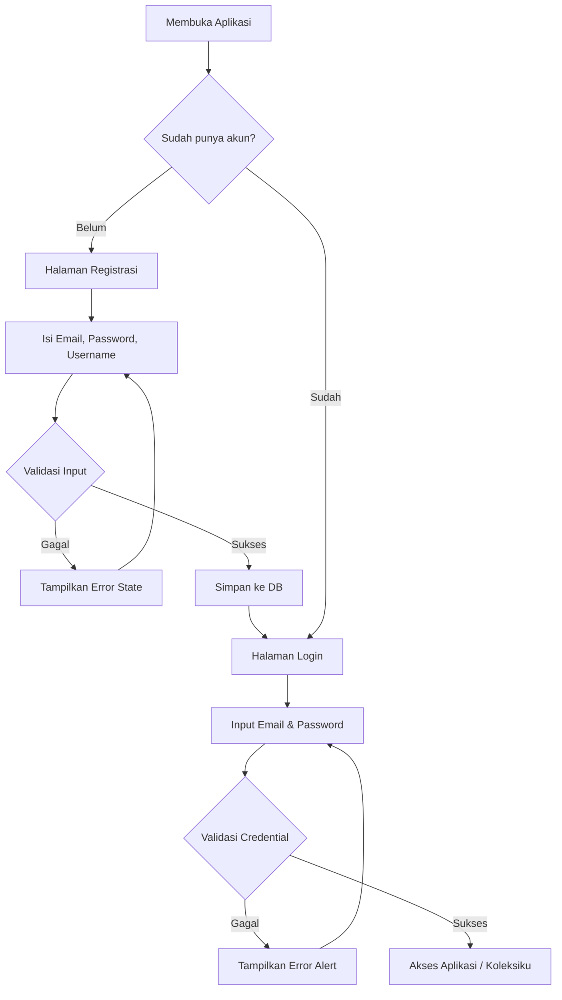
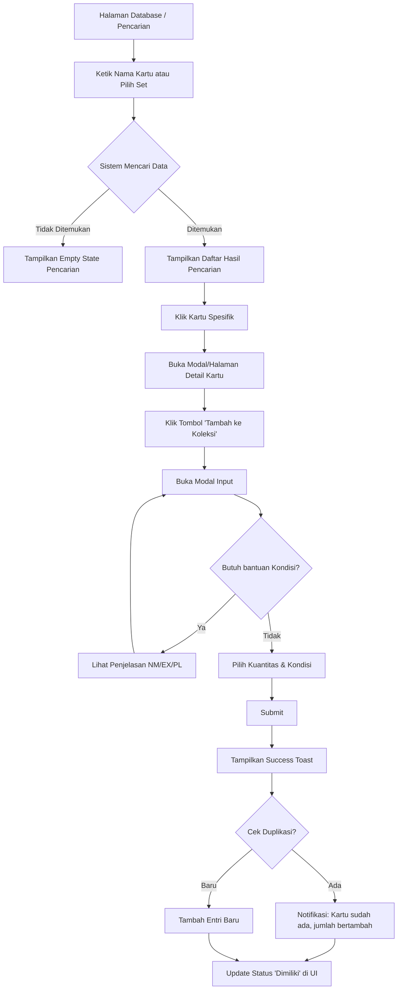
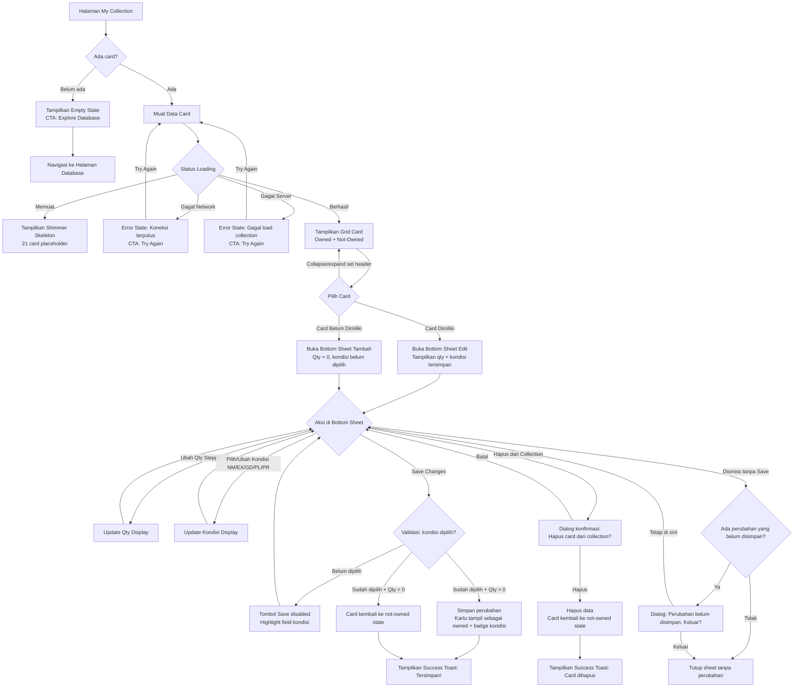
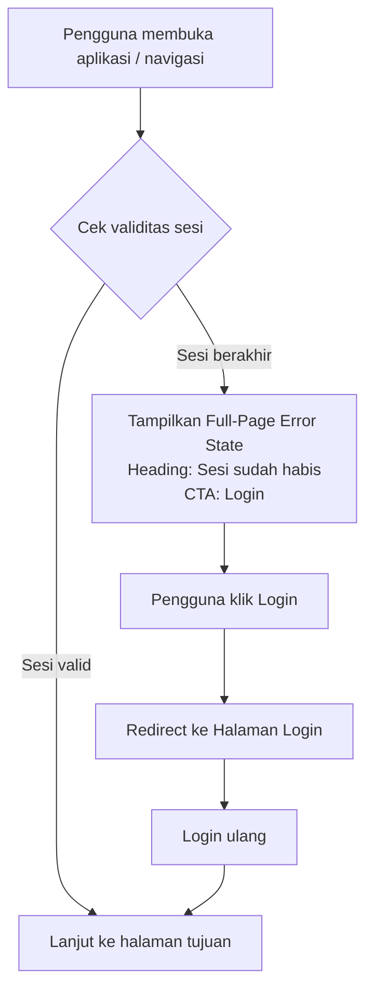

## Change Log

| Versi | Tanggal | Author | Perubahan |
|---|---|---|---|
| v1.0 | 2026-05-13 | Eka Dwi Ramadhan | Initial User Flow Diagrams |
| v1.1 | 2026-05-13 | Eka Dwi Ramadhan | Tambah keterangan agnostik-TCG di Overview; tambah catatan Phase 3+ untuk node pencarian di flow Adding Card to Collection; tambah poin ke-4 di Next Steps |

---

# User Flow Diagrams: ArkaDex

## Overview

Dokumen ini memetakan alur logika pengguna (user flow) untuk fitur-fitur utama ArkaDex fase MVP. Diagram dibuat menggunakan format Mermaid. Flow yang didokumentasikan di sini dirancang untuk MVP Pokemon TCG Indonesia, namun pola interaksi dasarnya (search → detail → add to collection) bersifat agnostik-TCG dan akan digunakan kembali untuk TCG lain di Phase 3+.

---

## Onboarding: Registration & Login

Alur pengguna saat pertama kali membuka aplikasi hingga masuk ke dashboard utama.

---

## Adding Card to Collection

Alur saat pengguna mencari kartu di database dan menambahkannya ke koleksi pribadi.

**Catatan Phase 3+:** Node B ("Ketik Nama Kartu atau Pilih Set") akan berkembang menjadi "Pilih TCG Type → Pilih Set → Ketik Nama Kartu" saat multi-TCG diaktifkan. Pola flow tidak berubah, hanya ada langkah filter tambahan di awal.

---

## Managing Collection (View & Edit)

Alur saat pengguna melihat daftar koleksi mereka dan melakukan pembaruan data atau penghapusan via Bottom Sheet.

---

## Session Timeout & Authentication Error

Alur saat sesi pengguna habis dan perlu login ulang.

---

## Next Steps

User flows ini siap untuk diterjemahkan ke dalam:
1. Mockup dan wireframe di Figma
2. Component specifications untuk tim engineering
3. Testing scenarios untuk QA
4. Review ulang user flows saat Phase 3+ dimulai untuk mengakomodasi langkah pemilihan TCG Type dan Language sebelum pencarian kartu.
