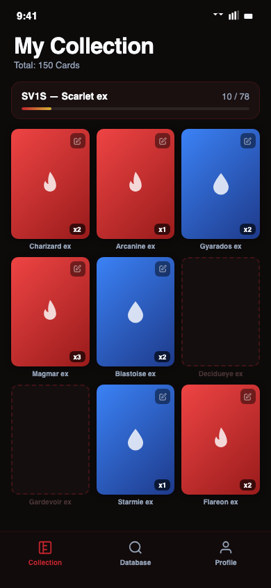
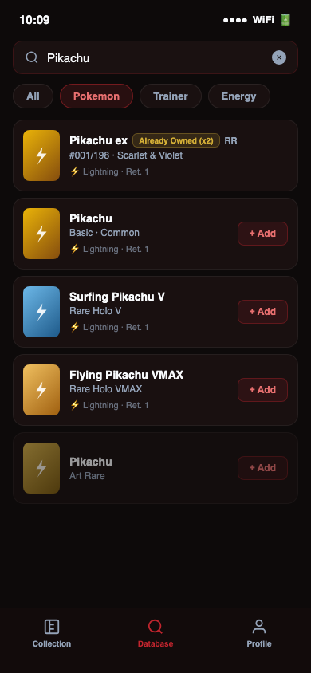
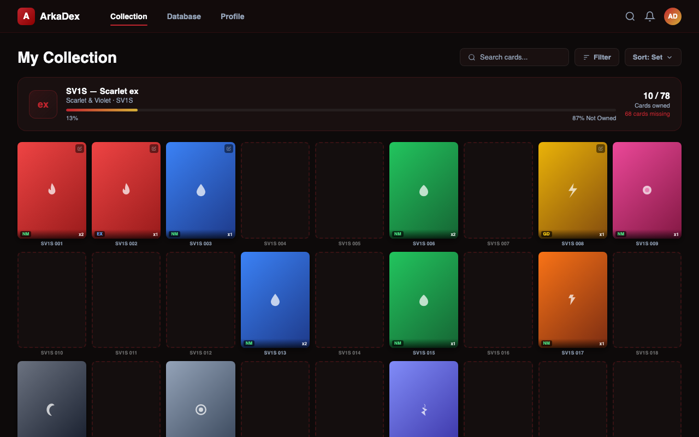

## Change Log

| Versi | Tanggal | Author | Perubahan |
|---|---|---|---|
| v1.0 | 2026-05-13 | Eka Dwi Ramadhan | Initial Design Handover Specification |
| v1.1 | 2026-05-13 | Eka Dwi Ramadhan | Tambah catatan tema per-TCG untuk token warna di Phase 3+; tambah catatan badge TCG Type dan Language Edition di Bottom Sheet untuk Phase 3+ |

---

# Design Handover Specification: ArkaDex

Dokumen ini berisi spesifikasi teknis untuk implementasi *High-Fidelity* (Hi-Fi) ArkaDex. Seluruh aset visual dan spesifikasi interaksi dirancang untuk memastikan pengalaman pengguna yang konsisten di seluruh platform.

## Visual Mockups

Berikut adalah representasi visual akhir untuk aplikasi ArkaDex:

````carousel

<!-- slide -->

<!-- slide -->

````

## Implementasi Token Design

Gunakan variabel berikut untuk konsistensi visual (referensi: `design-system-spec.md`).

| Elemen UI | Token Name | Properti CSS | Nilai (Dark Mode) |
| :--- | :--- | :--- | :--- |
| Background Utama | `--bg-surface-0` | `background-color` | `#0F172A` |
| Card Surface | `--bg-surface-1` | `background-color` | `rgba(30, 41, 59, 0.7)` |
| Primary Action | `--primary` | `background-color` | `#E3350D` (Pokemon Red) |
| Secondary Action | `--secondary` | `background-color` | `#30A7D7` (Water Blue) |
| Progress Bar | `--gradient-progress` | `background` | `linear-gradient(90deg, #E3350D, #30A7D7)` |
| Not-Owned Card | — | `background` | `rgba(30, 41, 59, 0.5)` + `border: 2px dashed rgba(255,255,255,0.15)` |
| Skeleton Base | — | `background` | `rgba(255, 255, 255, 0.08)` |

Catatan: Token warna `--primary` (Pokemon Red) dan `--secondary` (Water Blue) adalah branding MVP untuk Pokemon TCG. Untuk Phase 3+, sistem token akan diperluas dengan tema per-TCG (e.g., One Piece menggunakan palet merah-hitam bajak laut).

## Spesifikasi Mikro-Interaksi

Agar antarmuka terasa hidup, terapkan durasi dan kurva animasi berikut:

- **Bottom Sheet — Masuk:**
  - Durasi: `280ms`
  - Easing: `cubic-bezier(0.32, 0.72, 0, 1)` (native iOS sheet feel)
- **Bottom Sheet — Keluar:**
  - Durasi: `220ms`
  - Easing: `ease-in`
  - Trigger: swipe down > 80px, tap backdrop, atau tombol batal
- **Shimmer Skeleton:**
  - Durasi: `1.5s linear infinite`
  - Arah: `translateX(-100%) → translateX(100%)`
  - Warna overlay: `rgba(255,255,255,0) → rgba(255,255,255,0.06) → rgba(255,255,255,0)`
  - Fallback: nonaktifkan animasi jika `prefers-reduced-motion: reduce`
- **Search Debounce:** `300ms` sebelum memicu skeleton loader.
- **Grid Hover (Desktop):**
  - Scale: `1.05`
  - Durasi: `200ms ease-in-out`
  - Shadow: `0 10px 15px -3px rgba(0, 0, 0, 0.3)`

## Penanganan State & Edge Case

### Not-Owned Card

Kartu yang belum dimiliki ditampilkan sebagai slot placeholder di dalam grid, di posisi urutan nomor kartu yang semestinya.

- **Visual:** Background `rgba(30,41,59,0.5)`, border `2px dashed rgba(255,255,255,0.15)`, ikon `+` opacity 20% di tengah.
- **Interaksi:** Tap/klik membuka Bottom Sheet dengan qty = 0 (mode "tambah ke collection").
- **Label nama:** Teks slate-500 (lebih redup dari kartu dimiliki).
- **Aria-label pattern:** `"[Nama card], not in collection. Tap to add."`

### Empty State (Collection Kosong)

Ditampilkan di halaman My Collection ketika pengguna belum memiliki satu pun card.

- **Ilustrasi:** 3 kartu bertumpuk menggunakan style `card-not-owned` (konsisten dengan grid).
- **Copy heading:** `"Collection kamu masih kosong"`
- **Copy subheading:** `"Mulai tambah card yang kamu punya. Cari berdasarkan nama, set, atau tipe."`
- **CTA Primer:** `"Explore Database"` — background `--primary`, `rounded-xl`, `max-w-[240px]`.
- **CTA Sekunder:** `"Gimana cara kerjanya?"` — text link, tanpa background.
- **Varian zero-state setelah pakai:** Ganti subheading menjadi `"Semua card dihapus. Tambah lagi kapan aja."`

### Loading State (Shimmer Skeleton)

Ditampilkan saat data card sedang di-fetch dari server.

- Tampilkan **21 skeleton card** (mengisi 3 baris penuh di `grid-cols-3`) + skeleton set header.
- Skeleton card: class `skeleton-card` (reuse style `card-not-owned` + shimmer overlay).
- Skeleton header: placeholder lines untuk judul set, tanggal, dan progress bar.
- Mulai tampil **tanpa delay** (0ms) agar tidak ada blank screen flash.
- Sertakan `aria-busy="true"` dan `aria-label="Loading your collection..."` pada container.

### Error States

Tampil secara **inline di level section** (bukan full-page), kecuali auth failure.

| Tipe | Heading | Subheading | CTA | Tampilan |
| :--- | :--- | :--- | :--- | :--- |
| Network offline | `"Koneksi terputus"` | `"Cek koneksi internet kamu, terus coba lagi deh."` | `"Try Again"` | Inline section |
| Server error | `"Gagal load collection"` | `"Server lagi ada masalah. Coba lagi bentar lagi ya."` | `"Try Again"` | Inline section |
| Auth / session expired | `"Sesi kamu udah habis"` | `"Login lagi buat lanjut kelola collection kamu."` | `"Login"` | Full-page |

- Error container: class `glass`, `rounded-xl`, `p-10`, `flex flex-col items-center text-center`.
- Tombol Try Again: `border border-white/20`, `bg-white/5`, `hover:bg-white/10`.
- Sertakan `role="alert"` dan `aria-live="assertive"` pada container error.

### Long Text

Nama card yang melebihi lebar kontainer menggunakan `text-overflow: ellipsis` dengan `white-space: nowrap`. Tambahkan atribut `title="[nama card]"` untuk tooltip native browser.

## Spesifikasi Bottom Sheet (Edit Card)

Bottom Sheet adalah komponen utama untuk interaksi edit card, diakses via tap card (mobile & desktop) atau hover edit button (desktop only).

| Properti | Nilai |
| :--- | :--- |
| Background | class `glass` + `rounded-t-3xl` |
| Max height | `85dvh` |
| Z-index | `80` (di atas bottom nav z-50, di atas backdrop z-70) |
| Backdrop | `bg-black/50 backdrop-blur-sm`, fade `200ms ease` |
| Padding bawah | `calc(2rem + env(safe-area-inset-bottom, 0px))` |

**Struktur konten (urutan dari atas ke bawah):**

1. Handle bar — `w-10 h-1 bg-white/20 rounded-full mx-auto`
2. Badge tipe card + nama card (heading `text-lg font-bold`)
   - Phase 3+: Di bawah nama card, tampilkan badge kecil TCG Type dan Language Edition (e.g., "Pokemon TCG · Indonesia") untuk konteks multi-TCG.
3. **Kondisi Card** — Segmented control wajib diisi
   - Label: `"Kondisi Card"`
   - Pilihan: `NM` / `EX` / `GD` / `PL` / `PR` (5 tombol sejajar, full-width row)
   - Style aktif: `bg: --primary`, `text-white`; style default: `bg-white/10`, `text-slate-300`
   - Touch target per tombol: min **48pt height**
   - Untuk mode tambah (not-owned, qty=0): tidak ada pilihan terpilih saat sheet pertama buka — tombol Save disabled sampai kondisi dipilih
   - Untuk mode edit (owned card): tampilkan kondisi tersimpan sebagai pilihan aktif default
   - Info tooltip: ikon `(?)` di sebelah label, tap untuk tampilkan penjelasan NM/EX/GD/PL/PR
4. **Jumlah di Collection** — Stepper
   - Stepper `−` / qty / `+` — touch target min **48×48pt**
   - Tombol `−` disabled (`opacity-30`, `cursor-not-allowed`) saat qty = 0
   - Tidak ada batas bawah di bawah 0; batas atas: 99
5. Tombol **Save Changes** — `bg: --primary`, full-width, `h-12 rounded-xl`
   - Disabled (opacity 50%) jika kondisi belum dipilih (khusus mode tambah)
6. Tombol **Hapus dari Collection** — `text-red-400`, full-width, `h-10`, tanpa background
   - Hanya tampil pada mode edit (owned card), tidak tampil pada mode tambah (not-owned)

**Dismiss:** swipe down > 80px, tap backdrop, atau `Escape` (keyboard).

**Unsaved changes warning:** Jika pengguna mengubah qty atau kondisi lalu dismiss (swipe/backdrop/Escape) tanpa menekan Save, tampilkan dialog konfirmasi:
- Copy: `"Perubahan belum disimpan. Keluar?"` + dua tombol: `"Tetap di sini"` (default focus) dan `"Keluar"`

**Delete confirmation:** Sebelum menghapus, tampilkan dialog:
- Copy: `"Hapus [nama card] dari collection?"` + dua tombol: `"Hapus"` (merah) dan `"Batal"` (default focus)
- Setelah konfirmasi: card kembali ke not-owned state + success toast `"Card dihapus dari collection"`

**Success toast:** Muncul setelah Save Changes atau Delete berhasil.
- Posisi: bottom center, di atas bottom nav (`bottom: calc(80px + env(safe-area-inset-bottom)`)
- Style: `glass`, `rounded-xl`, `px-5 py-3`, `text-sm font-semibold`
- Durasi tampil: 2.5 detik, fade out 300ms
- Copy simpan: `"Tersimpan! ✓"`
- Copy hapus: `"Card dihapus dari collection"`

**Aria-label cards yang benar:**
- Owned: `"[Nama card], [n] copy dimiliki, kondisi [kondisi]. Tap untuk edit."`
- Not-owned: `"[Nama card], not in collection. Tap to add."`

## Spesifikasi Interaksi Tambahan

### Collapse Set Header

Set header per grup (contoh: "SV1S - Scarlet ex") dapat di-collapse untuk menyembunyikan grid kartu di bawahnya.

| Properti | Nilai |
| :--- | :--- |
| Trigger | Tap/klik area set header (seluruh area, bukan hanya chevron) |
| Affordance | Ikon chevron `▼` di sisi kanan header; berputar `180°` saat collapsed |
| Animasi expand | `max-height: 0 → max-height: [tinggi konten]`, `200ms ease-out` |
| Animasi collapse | `200ms ease-in` |
| State default | Expanded (semua set terbuka) |
| Persisten | Simpan state collapse/expand per set di localStorage |

### Condition Badge pada Card Grid

Tampilkan badge kondisi di bawah badge qty pada setiap kartu yang dimiliki.

| Properti | Nilai |
| :--- | :--- |
| Posisi | Pojok kiri bawah card (sejajar badge qty di kanan) |
| Style | `bg-black/60`, `px-1.5 py-0.5`, `rounded`, `text-[10px] font-bold` |
| Warna teks | NM: `text-green-400` / EX: `text-blue-400` / GD: `text-yellow-400` / PL: `text-orange-400` / PR: `text-red-400` |
| Contoh | Badge `NM` hijau di kiri bawah, badge `x2` di kanan bawah |

### Mobile Edit Affordance

Tombol edit (ikon pensil) tidak boleh mengandalkan hover untuk visibility di perangkat touch.

- **Solusi:** Tampilkan ikon pensil kecil (`w-4 h-4`) di pojok kanan atas setiap owned card secara permanen dengan `opacity-40`, meningkat ke `opacity-100` saat hover/focus
- **Touch device:** `opacity-60` permanen tanpa perubahan saat tap (edit tetap bisa dilakukan via tap card body)
- **Logika deteksi:** Gunakan `@media (hover: none)` untuk membedakan touch vs pointer device

### Tab Navigation — Non-Fungsional State

Tab Database dan Profile yang belum diimplementasikan harus memberikan feedback jelas.

- **Style:** `opacity-50`, tetap terlihat tapi tidak aktif secara visual
- **Interaksi:** Tap menampilkan toast singkat: `"Halaman ini segera hadir 🚧"` (2 detik)
- **Tidak boleh:** Navigasi tanpa feedback, halaman kosong, atau tidak ada respons sama sekali

## Struktur Grid & Spacing

- **Mobile:** 3 Kolom | Gap 12px | Margin samping 16px | Padding bottom `calc(80px + env(safe-area-inset-bottom, 0px))`.
- **Tablet:** 5 Kolom | Gap 24px | Margin samping 24px.
- **Desktop:** 7 Kolom | Gap 24px | Max-width 1280px | Centered | Padding top `var(--nav-height)`.
- **Nav height:** `--nav-height: 64px` (CSS variable, dipakai sebagai sticky offset).

---

**Status:** Prototype hi-fi dan spesifikasi lengkap siap diserahkan ke tim Engineering. Referensi implementasi: `prototype_dashboard.html`.
