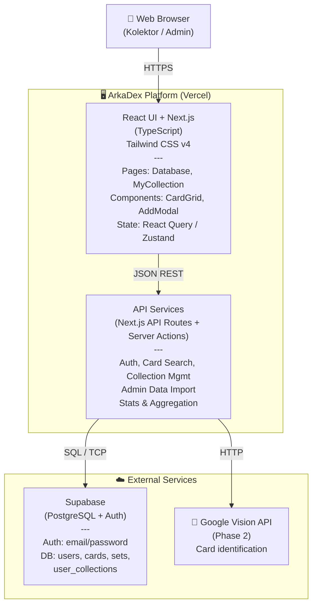
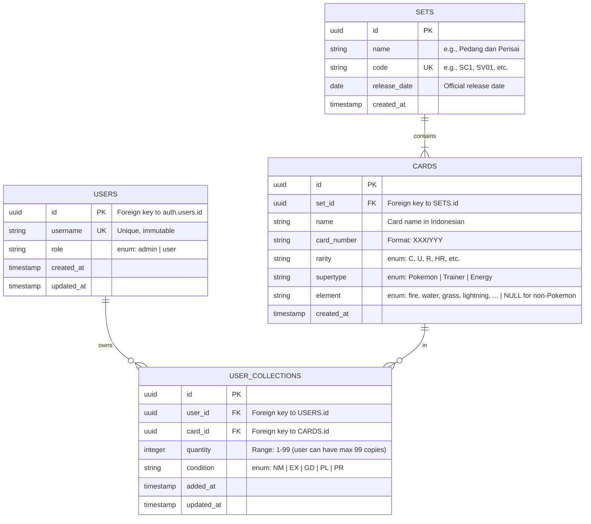
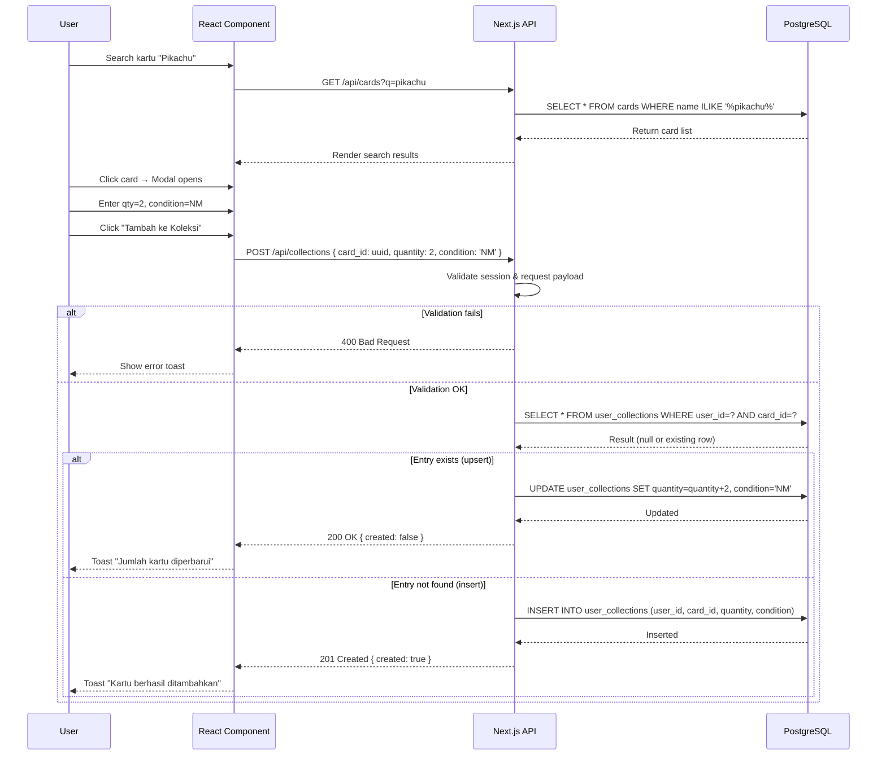
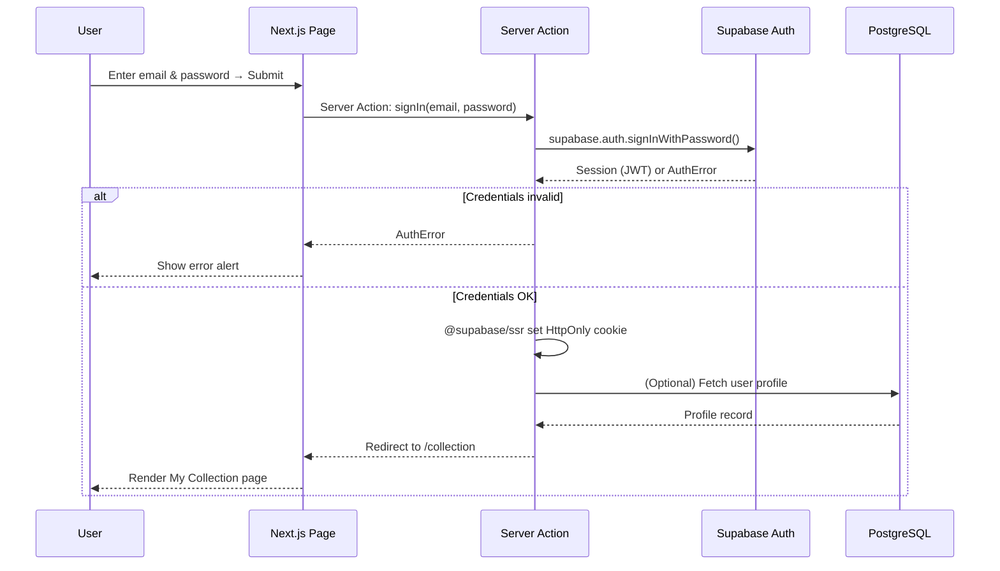

# Technical Design Document: ArkaDex

## Overview

**ArkaDex** adalah platform web fullstack untuk manajemen koleksi kartu Pokemon Trading Card Game (TCG) seri Indonesia. Dokumen ini mendeskripsikan arsitektur teknis, model data, kontrak API, dan keputusan desain fundamental yang menopang implementasi.

**Stack Teknis:**
- **Frontend:** React (via Next.js) + Tailwind CSS v4
- **Backend:** Next.js API Routes / Server Actions
- **Database:** PostgreSQL (managed via Supabase)
- **Authentication:** Supabase Auth
- **Hosting:** Vercel
- **Language:** TypeScript

---

## Background & Context

### Problem to Solve

Kolektor Pokemon TCG Indonesia saat ini mengelola koleksi dengan alat manual (spreadsheet, notes offline). Tidak ada platform terpusat yang akurat untuk database kartu Indonesia, dan sulit untuk track progress, share dengan komunitas, atau melakukan transaksi lokal.

### Design Principles

1. **User-Centric:** Desain API dan data model dari perspektif use case user, bukan struktur internal backend
2. **Type-Safe:** TypeScript di seluruh stack untuk mengurangi runtime errors
3. **Scalable-First:** Serverless architecture dari awal untuk mendukung pertumbuhan organik
4. **Maintainable:** Modular, well-documented, easy to extend untuk Phase 2+ features
5. **Legal-Compliant:** Tidak menyimpan/distribute artwork berlisensi The Pokemon Company

---

## Goals & Non-Goals

### Goals

1. **Performance:** API response time P95 < 500ms; page load < 3 detik untuk koneksi 4G
2. **Scalability:** Support 10.000+ concurrent users tanpa significant degradation
3. **Data Integrity:** ACID guarantees untuk consistency antara master data (CARDS) dan user collections
4. **Flexibility:** Architecture yang mudah diextend untuk Phase 2 features (scanner, gamification, trade matching)
5. **Security:** HTTPS, CSRF protection, secure session management, input validation ketat

### Non-Goals

1. Distributed microservices architecture (overkill untuk scope saat ini)
2. Multi-tenancy atau white-label platform
3. Real-time collaboration / concurrent editing
4. Offline-first capabilities
5. Custom ML model training (use pre-trained Vision API untuk scanner Phase 2)

---

## Architecture Overview

### 1.1 System Context (C4 Model — Level 1)

```
┌─────────────────────────────────────────────┐
│                                             │
│  User / Kolektor Pokemon TCG Indonesia      │
│  (Web Browser)                              │
│                                             │
└──────────────┬──────────────────────────────┘
               │
               │ HTTPS
               ▼
┌─────────────────────────────────────────────┐
│                                             │
│  ArkaDex Platform                           │
│  (Next.js + PostgreSQL)                     │
│                                             │
└──────────────┬──────────────────────────────┘
               │
               │ API Integration (Phase 2)
               ▼
      Google Vision API
     (Card Scanner Feature)
```

### 1.2 Container Diagram (C4 Model — Level 2)



### 1.3 Technology Decisions

| Layer | Technology | Justification |
|---|---|---|
| **Web Framework** | Next.js 16 | SSR for SEO, built-in API routes, Vercel deployment, TypeScript native |
| **Styling** | Tailwind CSS v4 | Utility-first, production-ready, mobile-responsive, consistent design |
| **State Management** | React Query + Zustand | React Query untuk server state (API caching), Zustand untuk client state |
| **Database** | PostgreSQL (Supabase) | Relational data model, ACID guarantees, managed service, built-in Auth |
| **Authentication** | Supabase Auth | Email/password, HttpOnly cookies, built-in session refresh, no custom JWT logic |
| **Hosting** | Vercel | Native Next.js support, serverless, auto-scaling, CDN, free tier sufficient for MVP |
| **ORM / Query** | Raw SQL + parameterized queries / Prisma (optional) | Direct control for performance; can add Prisma later if needed |
| **Image Processing** | Google Vision API | Pre-trained, no need custom ML model training |

---

## Data Model & Schema

### 2.1 Domain Concepts: Supertype vs Element

**Critical Note:** Pokémon TCG memiliki dua klasifikasi kartu yang BERBEDA dan harus disimpan terpisah:

- **`supertype`** — Klasifikasi utama: `Pokemon`, `Trainer`, `Energy`. **Berlaku untuk SEMUA kartu.**
- **`element`** — Tipe elemen Pokémon spesifik: `fire`, `water`, `grass`, `lightning`, `psychic`, `fighting`, `darkness`, `metal`, `dragon`, `fairy`, `colorless`. **Hanya untuk kartu `Pokemon`; NULL untuk `Trainer` dan kebanyakan `Energy`.**

**Mengapa pisah?**
```
SALAH: card_type = ['Pokemon', 'Fire', 'Trainer'] — tidak jelas hirarkinya
BENAR: supertype = 'Pokemon', element = 'fire'
```

Saat user mencari "tampilkan semua kartu tipe Water" ≠ "tampilkan semua Trainer". Jika dicampur ke satu field enum, query menjadi ambigu.

---

### 2.2 Entity-Relationship Diagram (ERD)



### 2.3 Schema Constraints & Indexing

#### Unique Constraints

| Constraint | Table | Columns | Reason |
|---|---|---|---|
| `UNIQUE(username)` | USERS | username | Prevent duplicate usernames |
| `UNIQUE(code)` | SETS | code | Set codes must be unique (SC1, SV01, etc.) |
| `UNIQUE(set_id, card_number)` | CARDS | set_id, card_number | One card per set per card number |
| `UNIQUE(user_id, card_id)` | USER_COLLECTIONS | user_id, card_id | One collection entry per user per card |

#### Indexes for Query Performance

| Index | Table | Columns | Use Case |
|---|---|---|---|
| `idx_user_collections_user_id` | USER_COLLECTIONS | user_id | Query: "Get all cards in MY collection" |
| `idx_user_collections_set_id` | USER_COLLECTIONS | (user_id, set_id) | Query: "Get my collection for set X" |
| `idx_cards_set_id` | CARDS | set_id | Query: "Get all cards in set X" |
| `idx_cards_name` | CARDS | name | Full-text search: "Find card by name" |
| `idx_cards_supertype_element` | CARDS | (supertype, element) | Filter: "All Pokemon type Fire" |

#### Check Constraints

```sql
-- Enforce nullability rules for element based on supertype
ALTER TABLE CARDS ADD CONSTRAINT check_element_rules
CHECK (
    (supertype = 'Pokemon' AND element IS NOT NULL)
    OR
    (supertype IN ('Trainer', 'Energy') AND element IS NULL)
);
```

### 2.4 Supabase Auth Integration

Tabel `USERS` adalah **profile table**, BUKAN tabel autentikasi:

- **Email & Password Hashing:** Dikelola sepenuhnya oleh `Supabase Auth` (tabel `auth.users` di schema auth)
- **USERS Table:** Hanya menyimpan `id` (FK to `auth.users.id`), `username`, `role`
- **Trigger:** Database trigger `handle_new_user()` otomatis membuat record di tabel `USERS` saat user mendaftar di Supabase Auth
- **Email Access:** Aplikasi membaca email dari `session.user.email` (Supabase session), bukan dari tabel USERS
- **Password Hash:** Tidak disimpan di schema publik; Supabase Auth mengelolanya secara internal dengan bcrypt

**Benefit:** Terpisah antara auth (sensitive) dan profile (application-specific).

### 2.5 Image Policy: No Local Artwork Storage

Per PRD §6 (Legal & Copyright Compliance):

- Tabel `CARDS` **TIDAK memiliki field `image_url` lokal**
- Aplikasi **tidak menyimpan atau mendistribusikan** gambar artwork berhak cipta The Pokémon Company
- **Solusi alternatif (Phase 2+):** 
  - Tautan ke sumber resmi (e.g., TCGPlayer, official Pokémon card database)
  - Atau legal review terhadap usage artwork dalam limited context
- **Fitur showcase / badge (Phase 2):** Hanya gunakan elemen visual original ArkaDex, bukan artwork kartu

---

## API Design & Contract

### 3.1 Overview

- **Format:** JSON REST
- **Auth:** Supabase session (HttpOnly cookie), required untuk endpoint Private
- **Error Response:** Standard format dengan error code + user-friendly message
- **Pagination:** Required untuk list endpoints; default limit 24, max 100

### 3.2 Global Error Response Format

```json
{
  "error": {
    "code": "VALIDATION_ERROR | NOT_FOUND | UNAUTHORIZED | SERVER_ERROR",
    "message": "Deskripsi error dalam Bahasa Indonesia yang dapat dipahami user"
  }
}
```

### 3.3 Authentication Endpoints (Public)

#### POST /api/auth/register
**Register pengguna baru dengan email & password**

**Request Body:**
```json
{
  "email": "user@example.com",
  "password": "SecurePass123",
  "username": "kolektor_indo"
}
```

**Response (201 Created):**
```json
{
  "user": {
    "id": "uuid",
    "email": "user@example.com",
    "username": "kolektor_indo"
  }
}
```

**Validasi:**
- Email: valid format, unique di auth.users
- Password: min 8 chars, uppercase + lowercase + number
- Username: 3-20 chars, alphanumeric + underscore, unique di USERS table

**Error Cases:**
- `400 Bad Request` — validation error
- `409 Conflict` — email atau username sudah terdaftar

---

#### POST /api/auth/login
**Login dengan email & password; set HttpOnly session cookie**

**Request Body:**
```json
{
  "email": "user@example.com",
  "password": "SecurePass123"
}
```

**Response (200 OK):**
```json
{
  "user": {
    "id": "uuid",
    "email": "user@example.com",
    "username": "kolektor_indo"
  },
  "session": {
    "access_token": "[jwt]",
    "refresh_token": "[jwt]"
  }
}
```

**Behavior:**
- Supabase Auth verifikasi password
- Sukses → set HttpOnly, Secure, SameSite=Lax cookie dengan session
- Gagal → `401 Unauthorized`

---

#### POST /api/auth/logout
**Logout pengguna; hapus session cookie**

**Request:** Empty body

**Response (200 OK):**
```json
{
  "message": "Logged out successfully"
}
```

**Behavior:** Clear HttpOnly session cookie; redirect ke login page

---

### 3.4 Master Data Endpoints (Public)

#### GET /api/sets
**Ambil daftar semua set Pokemon TCG Indonesia yang tersedia**

**Query Params:** None

**Response (200 OK):**
```json
{
  "sets": [
    {
      "id": "uuid-1",
      "name": "Pedang dan Perisai",
      "code": "SC1",
      "release_date": "2022-03-25"
    },
    {
      "id": "uuid-2",
      "name": "Evolving Skies (Indonesian)",
      "code": "SV04",
      "release_date": "2023-06-15"
    }
  ]
}
```

---

#### GET /api/cards
**Cari kartu dengan filter & pagination**

**Query Params:**

| Param | Type | Required | Description |
|---|---|---|---|
| `q` | string | No | Search by card name (case-insensitive, partial match using ILIKE) |
| `card_number` | string | No | Filter by exact card number (format: `001/100`) |
| `set_id` | UUID | No | Filter by set ID |
| `rarity` | string | No | Filter by rarity enum (C, U, R, HR, SR, etc.) |
| `supertype` | string | No | Filter by supertype: `Pokemon` \| `Trainer` \| `Energy` |
| `element` | string | No | Filter by element: `fire`, `water`, `grass`, etc. (only for Pokemon) |
| `page` | integer | No | Page number, default 1 |
| `limit` | integer | No | Items per page, default 24, max 100 |

**Response (200 OK):**
```json
{
  "total": 234,
  "page": 1,
  "limit": 24,
  "cards": [
    {
      "id": "uuid",
      "set_id": "uuid",
      "set_code": "SC1",
      "name": "Pikachu",
      "card_number": "025/102",
      "rarity": "HR",
      "supertype": "Pokemon",
      "element": "lightning"
    }
  ]
}
```

**Query Examples:**
- `GET /api/cards?q=pikachu&limit=12` — Cari kartu dengan nama "pikachu"
- `GET /api/cards?set_id=xxx&supertype=Trainer` — Semua kartu Trainer dari set tertentu
- `GET /api/cards?element=fire&rarity=R` — Semua kartu Pokemon tipe Fire dengan rarity Rare

---

#### GET /api/cards/:id
**Ambil detail lengkap satu kartu**

**Response (200 OK):**
```json
{
  "id": "uuid",
  "set_id": "uuid",
  "set_name": "Pedang dan Perisai",
  "set_code": "SC1",
  "name": "Charizard ex",
  "card_number": "117/102",
  "rarity": "HR",
  "supertype": "Pokemon",
  "element": "fire"
}
```

**Error:** `404 Not Found` jika card ID tidak ada

---

### 3.5 Collection Endpoints (Private — Require Auth)

#### GET /api/collections
**Ambil grid koleksi user untuk satu set beserta status kepemilikan**

**Query Params:**

| Param | Type | Required | Description |
|---|---|---|---|
| `set_id` | UUID | **Yes** | Set yang ingin ditampilkan grid-nya. Wajib untuk mencegah payload bloat. |

**Response (200 OK):**
```json
{
  "set_id": "uuid",
  "set_name": "Pedang dan Perisai",
  "set_code": "SC1",
  "total_cards": 102,
  "owned_count": 42,
  "completion_percentage": 41.2,
  "cards": [
    {
      "card_id": "uuid",
      "card_number": "001/102",
      "name": "Bulbasaur",
      "rarity": "Common",
      "supertype": "Pokemon",
      "element": "grass",
      "owned": true,
      "collection_id": "uuid",
      "quantity": 2,
      "condition": "NM"
    },
    {
      "card_id": "uuid",
      "card_number": "002/102",
      "name": "Ivysaur",
      "rarity": "Common",
      "supertype": "Pokemon",
      "element": "grass",
      "owned": false,
      "collection_id": null,
      "quantity": null,
      "condition": null
    }
  ]
}
```

**Backend Logic:**
- LEFT JOIN tabel CARDS dengan USER_COLLECTIONS
- Setiap entry dalam array = satu slot kartu di grid
- `owned: true` → user punya kartu; `owned: false` → dashed border UI

**Error:**
- `400 Bad Request` — `set_id` tidak diberikan
- `404 Not Found` — set_id tidak valid

---

#### GET /api/collections/stats
**Ambil statistik agregat koleksi user untuk overview & dashboard**

**Query Params:** None

**Response (200 OK):**
```json
{
  "total_cards_owned": 342,
  "total_unique_cards": 342,
  "sets_progress": [
    {
      "set_id": "uuid",
      "set_name": "Pedang dan Perisai",
      "set_code": "SC1",
      "total_cards_in_set": 102,
      "owned_count": 42,
      "completion_percentage": 41.2
    },
    {
      "set_id": "uuid",
      "set_name": "Evolving Skies",
      "set_code": "SV04",
      "total_cards_in_set": 198,
      "owned_count": 0,
      "completion_percentage": 0
    }
  ]
}
```

---

#### POST /api/collections
**Tambah kartu ke koleksi user, atau upsert jika sudah ada**

**Request Body:**
```json
{
  "card_id": "uuid",
  "quantity": 1,
  "condition": "NM"
}
```

**Response (201 Created — Insert Baru):**
```json
{
  "collection_id": "uuid",
  "card_id": "uuid",
  "quantity": 1,
  "condition": "NM",
  "created": true
}
```

**Response (200 OK — Upsert/Update Existing):**
```json
{
  "collection_id": "uuid",
  "card_id": "uuid",
  "quantity": 2,
  "condition": "NM",
  "created": false,
  "previous_quantity": 1
}
```

**Validasi:**
- `card_id`: Harus exist di tabel CARDS
- `quantity`: 1–99
- `condition`: Harus salah satu dari: `NM | EX | GD | PL | PR`

**Logic:**
```
IF (user_id, card_id) sudah ada di USER_COLLECTIONS:
  UPDATE quantity += request.quantity
  UPDATE condition = request.condition
  RETURN 200 OK { created: false }
ELSE:
  INSERT new entry
  RETURN 201 Created { created: true }
```

**Error:**
- `400 Bad Request` — validation error
- `404 Not Found` — card_id tidak ada
- `401 Unauthorized` — tidak authenticated

---

#### PUT /api/collections/:id
**Update kuantitas dan/atau kondisi entry koleksi**

**Request Body:**
```json
{
  "quantity": 2,
  "condition": "EX"
}
```

**Response (200 OK):**
```json
{
  "collection_id": "uuid",
  "card_id": "uuid",
  "quantity": 2,
  "condition": "EX"
}
```

**Error:**
- `404 Not Found` — collection entry ID tidak ada atau bukan milik user
- `400 Bad Request` — validation error

---

#### DELETE /api/collections/:id
**Hapus entry kartu dari koleksi user**

**Response (204 No Content)**

**Error:**
- `404 Not Found` — entry tidak ada atau bukan milik user

---

### 3.6 Admin Endpoints (Admin Only)

#### POST /api/admin/cards/import
**Bulk import data kartu via JSON; atomic operation**

**Request:**
- Content-Type: `application/json`
- Body: Array of card objects

**Request Body Example:**
```json
[
  {
    "set_code": "SV1S",
    "name": "Pikachu ex",
    "card_number": "049/078",
    "rarity": "Double Rare",
    "supertype": "Pokemon",
    "element": "lightning"
  },
  {
    "set_code": "SV1S",
    "name": "Professor's Research",
    "card_number": "050/078",
    "rarity": "Uncommon",
    "supertype": "Trainer",
    "element": null
  }
]
```

**Validasi Per Object:**

| Field | Validation |
|---|---|
| `set_code` | Required; must exist in SETS table; if not found, entire batch rejected (422) |
| `name` | Required; non-empty string |
| `card_number` | Required; format `XXX/YYY`; must be unique per (set_code, card_number) |
| `rarity` | Required; enum: C, U, R, HR, SR, etc. |
| `supertype` | Required; enum: `Pokemon \| Trainer \| Energy` |
| `element` | Conditional: if supertype=Pokemon → required; if Trainer/Energy → must be null |

**Validation Response (400 Bad Request):**
```json
{
  "error": {
    "code": "VALIDATION_ERROR",
    "message": "Batch import failed",
    "details": [
      {
        "row": 1,
        "field": "set_code",
        "error": "Set not found: 'INVALID_CODE'"
      },
      {
        "row": 3,
        "field": "element",
        "error": "Element must be null for Trainer supertype"
      }
    ]
  }
}
```

**Success Response (200 OK):**
```json
{
  "imported": 2,
  "skipped": 0
}
```

**Behavior:**
- Validasi schema dilakukan untuk seluruh array sebelum INSERT
- Jika ada error → seluruh batch ditolak (atomic); tidak ada data yang masuk
- Jika sukses → semua record di-insert

---

### 3.7 Rate Limiting

**Applied Endpoints:**
- `/api/auth/register` — Max 5 requests per IP per 15 minutes
- `/api/auth/login` — Max 10 requests per IP per 15 minutes (prevent brute force)
- `/api/collections` — Max 60 requests per user per minute (prevent scraping)

**Implementation:** Vercel Edge Middleware atau custom Next.js middleware dengan `redis` atau in-memory cache

---

## Component Design & Implementation

### 4.1 Frontend Architecture

```
src/
├── pages/
│   ├── index.tsx                 # Homepage
│   ├── auth/
│   │   ├── register.tsx
│   │   └── login.tsx
│   ├── database/
│   │   └── index.tsx             # Card search + database browser
│   └── collection/
│       └── [setId].tsx           # My Collection — grid per set
│
├── components/
│   ├── CardGrid.tsx              # Grid display owned/not-owned
│   ├── CardModal.tsx             # Card detail + add to collection
│   ├── AddCardDialog.tsx         # Modal: qty + condition picker
│   ├── SetProgressBar.tsx        # Completion % per set
│   ├── SearchBar.tsx             # Full-text search with debounce
│   └── AuthGuard.tsx             # Middleware for private routes
│
├── hooks/
│   ├── useCollections.ts         # React Query for collection data
│   ├── useCardSearch.ts          # React Query for card search
│   └── useAuth.ts                # Supabase session management
│
├── lib/
│   ├── api.ts                    # Fetch wrapper
│   ├── supabase.ts               # Supabase client init
│   └── utils.ts                  # Helpers (format percent, etc.)
│
└── types/
    └── index.ts                  # TypeScript interfaces (Card, Set, Collection)
```

### 4.2 Server-Side Logic

```
src/pages/api/
├── auth/
│   ├── register.ts
│   ├── login.ts
│   └── logout.ts
│
├── sets/
│   └── index.ts                  # GET /api/sets
│
├── cards/
│   ├── index.ts                  # GET /api/cards (search + filter)
│   └── [id].ts                   # GET /api/cards/:id
│
├── collections/
│   ├── index.ts                  # GET, POST, PUT, DELETE collections
│   └── stats.ts                  # GET /api/collections/stats
│
├── admin/
│   └── cards/
│       └── import.ts             # POST /api/admin/cards/import
│
└── middleware.ts                 # Session refresh, route protection
```

### 4.3 Database Seed & Migration

**Migration files** (Supabase SQL):

```sql
-- 001_init_schema.sql
CREATE TABLE public.users (
  id UUID PRIMARY KEY REFERENCES auth.users(id) ON DELETE CASCADE,
  username VARCHAR(20) UNIQUE NOT NULL,
  role VARCHAR(50) DEFAULT 'user',
  created_at TIMESTAMP DEFAULT CURRENT_TIMESTAMP,
  updated_at TIMESTAMP DEFAULT CURRENT_TIMESTAMP
);

CREATE TABLE public.sets (
  id UUID PRIMARY KEY DEFAULT gen_random_uuid(),
  name VARCHAR(255) NOT NULL,
  code VARCHAR(10) UNIQUE NOT NULL,
  release_date DATE,
  created_at TIMESTAMP DEFAULT CURRENT_TIMESTAMP
);

CREATE TABLE public.cards (
  id UUID PRIMARY KEY DEFAULT gen_random_uuid(),
  set_id UUID NOT NULL REFERENCES public.sets(id) ON DELETE CASCADE,
  name VARCHAR(255) NOT NULL,
  card_number VARCHAR(10) NOT NULL,
  rarity VARCHAR(50) NOT NULL,
  supertype VARCHAR(50) NOT NULL CHECK(supertype IN ('Pokemon', 'Trainer', 'Energy')),
  element VARCHAR(50) CHECK(element IN ('fire', 'water', 'grass', 'lightning', 'psychic', 'fighting', 'darkness', 'metal', 'dragon', 'fairy', 'colorless')),
  created_at TIMESTAMP DEFAULT CURRENT_TIMESTAMP,
  UNIQUE(set_id, card_number),
  CONSTRAINT check_element_rules CHECK (
    (supertype = 'Pokemon' AND element IS NOT NULL)
    OR (supertype IN ('Trainer', 'Energy') AND element IS NULL)
  )
);

CREATE TABLE public.user_collections (
  id UUID PRIMARY KEY DEFAULT gen_random_uuid(),
  user_id UUID NOT NULL REFERENCES public.users(id) ON DELETE CASCADE,
  card_id UUID NOT NULL REFERENCES public.cards(id) ON DELETE CASCADE,
  quantity INTEGER NOT NULL CHECK(quantity >= 1 AND quantity <= 99),
  condition VARCHAR(10) NOT NULL CHECK(condition IN ('NM', 'EX', 'GD', 'PL', 'PR')),
  added_at TIMESTAMP DEFAULT CURRENT_TIMESTAMP,
  updated_at TIMESTAMP DEFAULT CURRENT_TIMESTAMP,
  UNIQUE(user_id, card_id)
);

-- Indexes
CREATE INDEX idx_user_collections_user_id ON public.user_collections(user_id);
CREATE INDEX idx_user_collections_set_id ON public.cards(set_id);
CREATE INDEX idx_cards_name ON public.cards(name);
CREATE INDEX idx_cards_element_supertype ON public.cards(supertype, element);

-- Trigger: Auto-populate USERS profile table saat user baru register via Auth
CREATE OR REPLACE FUNCTION public.handle_new_user()
RETURNS TRIGGER AS $$
BEGIN
  INSERT INTO public.users (id, username)
  VALUES (NEW.id, NEW.email);
  RETURN NEW;
END;
$$ LANGUAGE plpgsql SECURITY DEFINER;

CREATE TRIGGER on_auth_user_created
  AFTER INSERT ON auth.users
  FOR EACH ROW
  EXECUTE FUNCTION public.handle_new_user();
```

---

## Process Flows & Sequences

### 5.1 Add Card to Collection Flow



### 5.2 Login & Session Flow



---

## Security Considerations

### 6.1 Authentication & Session Management

- **Method:** Supabase Auth with HttpOnly cookies via `@supabase/ssr`
- **CSRF Protection:** HttpOnly cookie with `SameSite=Lax` automatically prevents CSRF
- **Password Hashing:** Supabase Auth uses bcrypt internally; plaintext password never stored
- **Session Refresh:** `@supabase/ssr` middleware automatically refreshes token before expiry

### 6.2 Authorization

- **Route Protection:** Middleware checks `request.user` before allowing access to private routes
- **Data Isolation:** Endpoint `/api/collections` filters by `session.user.id` — user hanya bisa lihat koleksi mereka sendiri
- **Admin Routes:** `/api/admin/*` protected by role check: `user.role === 'admin'`

### 6.3 Input Validation

- **API Level:** Validate all inputs before database queries
- **Type Safety:** TypeScript prevents runtime type errors
- **Parameterized Queries:** All SQL queries use parameterized statements (prevent SQL injection)
- **Rate Limiting:** Auth endpoints rate-limited to prevent brute force

### 6.4 Data Protection

- **HTTPS Only:** All communication encrypted in transit
- **No Secrets in Client:** API keys, database credentials never exposed to browser
- **Logging:** Sensitive data (password, tokens) never logged

---

## Performance & Scalability

### 7.1 Database Performance

| Optimization | Implementation |
|---|---|
| **Indexing** | Indexes on frequently-queried columns: `user_id`, `set_id`, `name`, `(supertype, element)` |
| **Pagination** | Mandatory `limit` param (default 24, max 100); prevents full table scans |
| **Query Optimization** | Use `EXPLAIN ANALYZE` during performance testing; add covering indexes if needed |
| **Connection Pooling** | Supabase PgBouncer handles connection pooling for Vercel serverless |

### 7.2 API Performance

| Target | Metric | Method |
|---|---|---|
| **Response Time (P95)** | < 500ms | Monitor via observability tool; profile slow queries |
| **Throughput** | 10.000+ concurrent users | Serverless auto-scaling; stateless design |
| **Cache Strategy** | React Query client-side caching; next-on-demand-revalidation for static data | Cache cards, sets (low mutation frequency) |

### 7.3 Frontend Performance

| Optimization | Implementation |
|---|---|
| **Lazy Loading** | Code splitting via Next.js dynamic imports; SSR for initial load |
| **Image Optimization** | Next.js Image component with lazy loading (though no local artwork) |
| **State Management** | React Query for server state; Zustand for client state (avoid prop drilling) |
| **Bundle Size** | Tree-shaking; critical CSS inlining |

---

## Testing Strategy

### 8.1 Unit Tests

- **Coverage:** Utility functions, validators, type guards
- **Framework:** Jest + React Testing Library
- **Target:** > 80% coverage for critical paths

### 8.2 Integration Tests

- **Coverage:** API endpoints, database operations
- **Framework:** Jest + supertest (or Playwright for E2E)
- **Database:** Separate test DB; data seeding before each test

### 8.3 Performance Tests

- **Load Testing:** k6 or Apache JMeter to simulate 10.000+ concurrent users
- **Database Query Analysis:** `EXPLAIN ANALYZE` for slow queries
- **Page Load Time:** Lighthouse audit; target < 3 seconds

### 8.4 Security Tests

- **OWASP Top 10:** Manual review for XSS, CSRF, SQL Injection, etc.
- **Auth Flows:** Test session expiry, token refresh, logout
- **Input Validation:** Fuzz testing with invalid payloads

---

## Deployment & Operations

### 9.1 Deployment Pipeline

```
Git Push → GitHub Actions
  ↓
  ├─ Linting (ESLint) + Type Check (tsc)
  ├─ Run Tests (Jest)
  ├─ Build Next.js app
  └─ Deploy to Vercel (staging) → Manual Approval → Deploy to Vercel (production)
```

### 9.2 Monitoring & Observability

| Metric | Tool | Alert Threshold |
|---|---|---|
| **API Response Time** | Vercel Analytics / Sentry | P95 > 1s |
| **Error Rate** | Sentry | > 1% of requests |
| **Database Connection Errors** | Supabase metrics | > 5 per minute |
| **Uptime** | Uptime Robot | < 99.5% monthly |

### 9.3 Database Backups

- **Frequency:** Daily automated backups (Supabase managed)
- **Retention:** 7 days
- **Recovery:** Test restore procedure quarterly

### 9.4 Scaling Plan

**Milestones & Actions:**

| Users | Action |
|---|---|
| < 1.000 | Current setup (Vercel + Supabase free tier) |
| 1.000–10.000 | Monitor metrics; upgrade Supabase tier if needed |
| 10.000+ | Consider Supabase Pro tier; enable caching layer (Redis); CDN optimization |

---

## Open Questions & Decisions

### OQ-001: Vision API for Card Scanner (Phase 2)

**Status:** Pending Phase 2 approval

- **Option A:** Google Vision API — Pre-trained, reliable, but per-query cost
- **Option B:** Custom ML model — Requires training dataset of TCG Indonesia cards; higher upfront cost
- **Decision:** TBD; recommend Option A for MVP Phase 2 due to low training overhead

### OQ-002: User Geo-Location for Trade Matching (Phase 2)

**Status:** Pending user research validation

- **Question:** User willing to expose city location to other users for trade matching?
- **Risk:** Privacy concern; mitigated by anonymized matching (reveal identity only after acceptance)
- **Timeline:** User research survey before Phase 2 development

### OQ-003: Payment Gateway for Future Marketplace

**Status:** Out of scope Phase 1-2

- **Assumption:** Phase 1-2 trade matching is contact-only (no in-app payment)
- **Future Decision:** If marketplace becomes necessary, evaluate Stripe, Midtrans (local Indonesia provider), or GCash

---

## References & Resources

### Architecture & Design Patterns

- [Next.js Documentation](https://nextjs.org/docs)
- [Supabase Documentation](https://supabase.com/docs)
- [PostgreSQL Best Practices](https://www.postgresql.org/docs/current/)
- [RFC 7231 — HTTP Semantics](https://tools.ietf.org/html/rfc7231)

### Security

- [OWASP Top 10 2023](https://owasp.org/www-project-top-ten/)
- [NIST Cybersecurity Framework](https://www.nist.gov/cyberframework/)

### Performance

- [Web Vitals](https://web.dev/vitals/)
- [Lighthouse](https://developers.google.com/web/tools/lighthouse)

### Related Documents

- Product Requirements Document: `/docs/01-product/prd-arkadex.md`
- API OpenAPI Spec: `/docs/03-api/openapi-arkadex.yaml` (TBD)
- Deployment Runbook: `/docs/06-operations/deployment-runbook.md` (TBD)

---

**Document Version Control:**
- **v1.0** (2026-05-12): Initial TDD — Phase 1 MVP architecture
