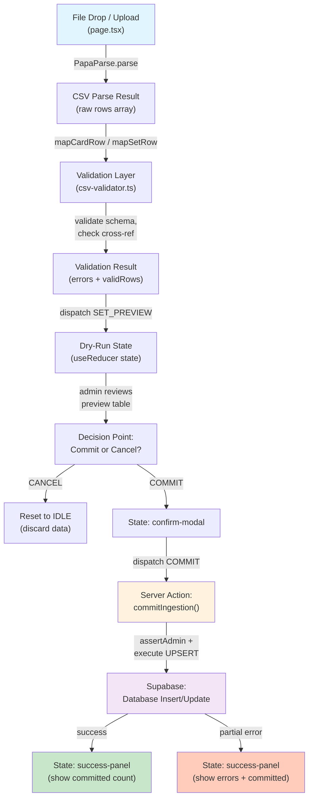

# ADR-004: Bulk Data Ingestion Strategy for IDN TCG Cards

**Status:** Accepted  
**Date:** 2026-05-16  
**Author:** Principal Technical Writer  
**Deciders:** PM, Solutions Architect + Dev, QA  
**Phase:** M1 Foundations (Phase E: Bulk Upload Admin Surface)

---

## 1. Context

The ArkaDex application requires a bulk data ingestion mechanism due to the significant volume of IDN TCG collections. This decision addresses three operational constraints:

### 1.1 Data Quality Gate (KR4)

Milestone M1 has Acceptance Criteria AC-03 and Key Result KR4 that require:
- Bulk ingestion **must support 500+ cards per import** for operational efficiency
- **Mandatory two-stage validation** (client + server) before data enters the database
- **Dry-run preview mandatory** before commit (AC-03)
- **Idempotent UPSERT semantics** to enable re-import without duplication

This constraint ensures that every bulk operation maintains TCG data integrity, particularly for unique attributes like `set_code` + `card_number`.

### 1.2 Admin-Only Surface with Defense-in-Depth

The bulk upload feature is only accessible by admins. Access control is enforced in layers:
- Frontend: Admin check via `assertAdmin()` in each Server Action
- Database: Write operations execute via the `service_role` key inside the Server Action, bypassing RLS. The `anon` and `authenticated` roles have no write access to `sets` or `cards` tables.
- Service Role Key: Used only in backend Server Action, never exposed to the browser
- Implication: No direct Supabase client library calls in the upload feature; all write paths go through `src/app/admin/bulk-upload/actions.ts`

> **Note (T1.5 Phase A correction):** The original draft stated "RLS policy `is_admin = true` on `sets` and `cards` tables." This was inaccurate. Admin status is not stored in the database. See ADR-003 §5 and ADR-005 §3 for the authoritative admin access control design. The actual database-layer protection is that the `anon`/`authenticated` Supabase roles have no INSERT/UPDATE/DELETE policies on master data tables; only the `service_role` key (held exclusively by the Server Action) can write.

### 1.3 IDN TCG Data Characteristics & CSV Quirks

The TCGdex data source has specific characteristics that affect the ingestion format:
- **Fields with spaces and special characters:** Example card names like "Rayquaza VMAX" or "Eevee ex", set name "Scarlet & Violet"
- **Quoted comma handling:** CSV with values containing commas (e.g., description field) requires a robust parser
- **UTF-8 BOM in Windows files:** Files exported from Windows Excel often have a BOM marker, creating parsing error risk
- **Enum-constrained fields:** `rarity` (C/U/R/RR/SR/UR), `supertype` (Pokémon/Trainer/Energy), `element` (Grass/Fire/Water/etc.)

**Verification evidence:** PapaParse (EC-01) and RFC-EDGE-CASES-03 have validated that this parser handles quoted commas and BOM without custom preprocessing.

---

## 2. Decision

### 2.1 Input Format & File Constraints

**2.1.1 Selected Format: CSV Only (via PapaParse)**

- **Format:** CSV (Comma-Separated Values) using the PapaParse library
- **JSON:** Out of scope per OQ-03; JSON ingestion deferred to a future phase if the data source changes
- **Rationale for CSV:**
  - Compatible with Excel export (admin workflow already familiar)
  - PapaParse natively handles quoted commas and UTF-8 BOM (EC-01 verified)
  - File size is smaller than JSON for similar datasets
  - RFC-EDGE-CASES-03 proves PapaParse is robust for IDN character sets

**2.1.2 Hard File Limits**

| Parameter | Limit | Rationale |
|-----------|-------|-----------|
| Max rows (Cards) | 500 data rows (+ header) | Prevent timeout, memory bloat; typical set ~150-200 cards |
| Max rows (Sets) | 50 data rows (+ header) | Sets rarely change > 50/quarter; align with card batch size |
| Max file size | 5 MB | Browser memory constraint, Vercel function timeout (10s target) |
| Encoding | UTF-8 (with/without BOM) | IDN character support, Windows Excel compatibility |

**2.1.3 Two-Stage Validation**

1. **Client-Side (Browser):**
   - File type: `.csv` extension check
   - File size: < 5 MB (pre-upload warning)
   - Row count: Parse preview, warn if > 500 rows (cards) or > 50 rows (sets)
   - Purpose: Fail-fast UX, reduce server load

2. **Server-Side (PapaParse + csv-validator.ts):**
   - Re-parse file to eliminate client-side tampering risk
   - Schema validation: Required fields, data type check, enum constraint
   - Cross-reference validation: Set existence check before upserting cards
   - Duplicate detection: Flag duplicate `(set_code, card_number)` within a single batch
   - Error collection: Accumulate errors, return detailed feedback per row

---

### 2.2 Pipeline Architecture

The ingestion flow from file upload to database commit is structured as a pipeline with clear separation of concerns:



**Key transitions:**
- `File Drop → PapaParse`: Immediate parse for preview
- `PapaParse → csv-validator.ts`: Synchronous validation (< 500ms target)
- `Validation → useReducer`: Dispatch `SET_PREVIEW` action
- `Preview → confirm-modal → commitIngestion`: Server Action via `src/app/admin/bulk-upload/actions.ts`

---

### 2.3 Dry-Run Mandatory & State Machine

**2.3.1 Dry-Run Preview Requirement**

Before committing to the database, the admin **must view a preview** that displays:
- **NEW:** Rows to be inserted (set/card does not exist previously)
- **OVERWRITE:** Rows to be updated (set/card already exists, data changed)
- **ERROR:** Rows that failed validation (displayed with specific error message per row)
- **Committed count:** Statistics for the number of NEW + OVERWRITE rows to be committed

Implementation: Preview mode in `useReducer` state machine before final commit.

**2.3.2 State Machine Definition**

The ingestion feature uses `useReducer` with 9 states and explicit guards to prevent illegal transitions:

```mermaid
stateDiagram-v2
    [*] --> idle

    idle -->|SET_MODE (import_sets | import_cards)| file-selected
    file-selected -->|SET_FILE| file-selected: update file info
    file-selected -->|PARSE_ERROR| critical-error: parsing failed
    
    file-selected -->|RUN_DRY_RUN| validating
    validating -->|SET_PREVIEW| preview: validation successful
    validating -->|SET_ERRORS| critical-error: validation failed (all rows error)
    
    critical-error -->|RESET| idle
    
    preview -->|EDIT_FILE| file-selected: user selects different file
    preview -->|CANCEL| idle
    preview -->|PROCEED_TO_CONFIRM| confirm-modal
    
    confirm-modal -->|CONFIRM_COMMIT| committing
    confirm-modal -->|CANCEL| preview: return to preview
    
    committing -->|COMMIT_SUCCESS| success-panel
    committing -->|COMMIT_ERROR| critical-error
    
    success-panel -->|NEW_UPLOAD| idle
    
    idle -->|[no further action]| idle
```

**2.3.3 Guard Conditions (Prevent Illegal Transitions)**

| From State | Action | Guard | Allowed? | Consequence |
|-----------|--------|-------|----------|------------|
| `idle` | `SET_MODE` | Always | ✅ Yes | Transition to `file-selected` |
| `file-selected` | `RUN_DRY_RUN` | File size < 5MB, row count ≤ limit | ✅ Yes | Transition to `validating` |
| `file-selected` | `PROCEED_TO_CONFIRM` | - | ❌ No | Dispatch ignored, error toast |
| `preview` | `COMMIT` | File not changed since preview | ✅ Yes | Transition to `confirm-modal` |
| `preview` | `COMMIT` | File hash mismatch | ❌ No | Error toast, stay in preview |
| `confirm-modal` | `CONFIRM_COMMIT` | Admin confirmed stats | ✅ Yes | Transition to `committing` |
| `committing` | `RUN_DRY_RUN` | - | ❌ No | Dispatch ignored (ongoing request) |
| `success-panel` | `NEW_UPLOAD` | - | ✅ Yes | Transition to `idle` |

**Rationale for mandatory dry-run:**
- AC-03 requirement: preview before commit
- Prevents accidental bulk data corruption
- Allows admin to review error rows and fix CSV before retry
- De-risk production impact

---

### 2.4 Write Path: Server Action + Service Role Key

**2.4.1 All Writes via Server Action**

The application does not use the direct Supabase client library (SupabaseClient) for insert/update in the bulk upload feature. All writes go through a Next.js Server Action at `src/app/admin/bulk-upload/actions.ts`:

```typescript
// Pattern (pseudocode)
"use server"

export async function commitIngestion(payload: CommitPayload) {
  assertAdmin(await auth.currentUser());  // ← Defense layer 1
  
  const supabase = createClient({
    // Service Role Key accessed from env secret
    // NEVER exported to frontend
  });
  
  // UPSERT logic here
  // Database RLS active, checked by Supabase service layer
  
  return { success: true, committed: X };
}
```

**2.4.2 assertAdmin() Defense-in-Depth**

Each Server Action has an assertion that validates:
- User is logged in (session valid)
- User email is in `ADMIN_EMAIL_WHITELIST` env var (sole source of truth for admin status)
- Request signature is valid (Next.js built-in protection)

If the assertion fails, the function throws an error (no silent failure) and the frontend receives 401/403.

> **Note (T1.5 Phase A correction):** The original draft included "User has `is_admin = true` in the database" as a separate assertion bullet. This was inaccurate and has been removed. Admin status is determined exclusively by `ADMIN_EMAIL_WHITELIST`. No `is_admin` field exists in the database. See ADR-003 §5 and ADR-005 §3.

**2.4.3 Service Role Key Security**

- **Location:** Store in `SUPABASE_SERVICE_ROLE_KEY` in `.env.local` (development) and Vercel env secret (production)
- **Access:** Only the Server Action file can access via `process.env.SUPABASE_SERVICE_ROLE_KEY`
- **Never exposed:** Not inlined into client-side code, not logged to browser console
- **Implication:** Client cannot bypass RLS; all write requests are validated by the backend

---

### 2.5 Set Resolution & Conflict Policy

**2.5.1 Set Not Found = Reject Entire Batch**

When an admin imports cards, each row must reference a set that already exists in the `sets` table:
- **Validation step (pre-commit):** csv-validator.ts queries the `sets` table, collects missing set codes
- **If any missing:** Mark the entire batch as `CRITICAL_ERROR`, state machine transitions to `critical-error`
- **User action:** Import sets first, then retry the cards import
- **Error message:** "Sets not found: [SV4, SV5]. Import sets first before cards."

Rationale: Partial card import without sets would create orphaned data; fail-fast is better and instrumented.

**2.5.2 UPSERT Semantics with Conflict Policy**

Conflict resolution for cards and sets:

**Sets table:**
```sql
INSERT INTO sets (code, name, release_date, total_cards)
VALUES (...)
ON CONFLICT (code) DO UPDATE SET
  name = EXCLUDED.name,
  release_date = EXCLUDED.release_date,
  total_cards = EXCLUDED.total_cards
WHERE sets.id IS NOT NULL;  -- Only update, not insert
```

**Cards table:**
```sql
INSERT INTO cards (set_id, card_number, card_name, rarity, supertype, element, image_url)
VALUES (...)
ON CONFLICT (set_id, card_number) DO UPDATE SET
  card_name = EXCLUDED.card_name,
  rarity = EXCLUDED.rarity,
  supertype = EXCLUDED.supertype,
  element = EXCLUDED.element,
  image_url = EXCLUDED.image_url;
```

**Implication:** If card (SV4, 001) already exists, re-importing SV4 with new data for card 001 will update all fields; the card will not be duplicated.

**2.5.3 Partial Commit Acceptable with Error Log**

Scenario: 500 card rows, row 250 fails validation (e.g., invalid rarity value). Behavior:

1. **Batch chunking:** Process 100 rows per server hit (to avoid timeout)
2. **Per-chunk error handling:** If row has a schema error, **skip row**, **log to ingestion_logs**, continue
3. **Committed count:** Report "Committed: 490 rows, Skipped: 10 rows (see logs)"
4. **Recovery:** Admin can inspect `ingestion_logs` table, fix CSV, re-import (idempotent UPSERT)

Rationale: 
- 490/500 rows successfully committed; better than 0/500 (all-or-nothing would be frustrating)
- Idempotent UPSERT ensures re-import is safe
- Error tracking in `ingestion_logs` for audit trail
- M2 milestone will add UI recovery feature (re-import only error rows)

---

### 2.6 Schema Extension: Option B (Supertype & Element)

**2.6.1 Motivation**

Filter features by card type (Pokémon/Trainer/Energy) and element (Grass/Fire/Water/etc.) are basic expectations for IDN collectors. Without these fields, card data is incomplete; collection browsing in M2 would lack crucial filters.

**2.6.2 Schema Change**

Add 2 nullable TEXT columns to the `cards` table:

| Column | Type | Nullable | Default | Rationale |
|--------|------|----------|---------|-----------|
| `supertype` | TEXT | YES | NULL | Pokémon \| Trainer \| Energy (enum at app layer) |
| `element` | TEXT | YES | NULL | Grass, Fire, Water, Lightning, Psychic, Fighting, Dragon, Colorless, Metal (enum at app layer) |

**2.6.3 Database Migration**

File: `supabase/migrations/20260516003330_add_supertype_element_to_cards.sql`

```sql
-- Add columns to cards table
ALTER TABLE cards ADD COLUMN supertype TEXT;
ALTER TABLE cards ADD COLUMN element TEXT;

-- Add comments for documentation
COMMENT ON COLUMN cards.supertype IS 'Pokémon | Trainer | Energy card type';
COMMENT ON COLUMN cards.element IS 'Card element: Grass, Fire, Water, Lightning, Psychic, Fighting, Dragon, Colorless, Metal';

-- Create index for faster filtering
CREATE INDEX idx_cards_supertype ON cards(supertype);
CREATE INDEX idx_cards_element ON cards(element);
```

**2.6.4 Cost Assessment**

- **Migration time:** < 100ms on Personal Alpha (table size ~ 200-500 rows initially)
- **Backward compatibility:** Old API responses are not affected (new columns nullable, default NULL)
- **Schema bloat:** 2 TEXT columns ≈ 32 bytes overhead per row (negligible)
- **Testing:** App layer validation + ingestion integration test for supertype/element enum

---

### 2.7 Auto-Update total_cards via Application Layer

**2.7.1 Behavior**

After successfully committing a card batch, the server action must update `sets.total_cards` for each set that was touched:

```typescript
// Pseudo-logic in commitIngestion()
const updatedSetIds = new Set(committedCards.map(c => c.set_id));

for (const setId of updatedSetIds) {
  const { count } = await supabase
    .from('cards')
    .select('id', { count: 'exact' })
    .eq('set_id', setId);
  
  await supabase
    .from('sets')
    .update({ total_cards: count })
    .eq('id', setId);
}
```

**2.7.2 Why Not DB Trigger?**

Alternative: PostgreSQL trigger on the `cards` table to auto-update `sets.total_cards`.

We chose the application layer because:
- **Logic visibility:** Admin/dev can trace flow in codebase, not in the database
- **Testability:** Unit test in TypeScript is more straightforward
- **Audit trail:** Every update is logged in the app, queryable in ingestion_logs
- **Control:** If future logic exists (e.g., count only specific rarity), it can be parameterized without SQL change

Trade-off: Slightly more verbose, but operational clarity is higher.

---

## 3. Consequences

### 3.1 Positive Consequences

1. **Data Quality Enforced**
   - Two-stage validation (client + server) ensures garbage data does not enter the database
   - Dry-run preview is mandatory before commit; admin can review and fix error rows
   - UPSERT is idempotent: re-import is safe, no duplication

2. **Defense-in-Depth Architecture**
   - assertAdmin() at each Server Action layer
   - RLS policy at the database layer (write-deny for non-service_role)
   - Service Role Key is not exposed to the frontend
   - Multi-layer security prevents privilege escalation

3. **UPSERT Semantics Idempotent**
   - Import SV4 set 3x → final result is the same (last write wins)
   - Rollback/retry scenarios are not risky; re-import is safe
   - Simplifies operational recovery

4. **Schema Ready for M2 Collection Filtering**
   - `supertype` and `element` fields add minimal overhead
   - Enable type/element filter UI in M2 milestone without schema change
   - Future card search/browse features require no architecture redesign

### 3.2 Negative Consequences & Trade-offs

1. **Partial Commit Complexity**
   - Admin needs to read `ingestion_logs` to understand which rows failed
   - No UI form to re-import only error rows (deferred M2 feature)
   - Operational overhead: manual CSV fix, re-upload

   **Mitigation:** Detailed error message per row in preview table; runbook instructions are clear

2. **KR4 Formal Verification Pending**
   - KR4 requirement: "Data quality gate before 500+ card bulk"
   - Current validation: csv-validator.ts + PapaParse + dry-run preview
   - **Formal sign-off:** Sample min 10% of cards or 20 rows minimum from importer, cross-check vs TCGdex source
   - **Status:** **CONDITIONAL PASS** — pending manual audit before M2 Content milestone
   - Runbook section 6 details the audit checklist

3. **Security, DI, Performance Testing Deferred (Gate e)**
   - Current implementation is not formally tested for SEC/DI/PERF gates
   - **SEC:** Server Action + RLS tested ad-hoc; no pentest
   - **DI:** No chaos injection (e.g., network failure during commit); recovery untested
   - **PERF:** 500-row commit time not profiled; 10s function timeout assumption not validated
   - **Status:** **CONDITIONAL PASS** — these gates recommended pre-M2 Content, post-Foundations

   **Mitigation:** Runbook section 7 includes "Known Limitations" note; prioritize Gate e testing pre-M2

4. **CSV-Only Constraint Future-Proofing**
   - If TCGdex only exposes JSON API in the future, PapaParse CSV ingestion becomes a bottleneck
   - JSON ingestion is out of scope per OQ-03, but deferral is not infinite
   - **Mitigation:** Mark OQ-03 for review pre-M3 (next major phase)

---

## 4. Cross-References & Related Documents

### ADR & Architecture Foundation
- **ADR-001:** Overall data architecture & RLS foundation
- **ADR-002:** Admin role & permission model
- **ADR-003:** RLS architecture at database layer

### Feature Specifications
- **F-03-lean-cms.md:** Bulk ingestion requirements, input format spec
- **T1.3-scope-preflight.md:** Scope boundaries, OQ-03 (JSON out of scope)
- **F-03-ingestion-audit.md:** KR4 audit checklist & manual verification procedure

### Operational Reference
- **cms_ingestion_runbook.md:** Step-by-step admin workflow (docs/ops/)

### Implementation Files
- **src/app/admin/bulk-upload/page.tsx:** UI page with form, file drop, preview table
- **src/app/admin/bulk-upload/actions.ts:** Server Actions (commitIngestion, etc.)
- **src/app/admin/bulk-upload/csv-validator.ts:** CSV schema validation logic
- **src/lib/ingestion.ts:** Types & utility functions (CommitPayload, ValidationResult, etc.)

### Database
- **supabase/migrations/20260516003330_add_supertype_element_to_cards.sql:** Migration file for supertype/element columns
- **supabase/migrations/[earlier]_create_ingestion_logs.sql:** Audit logging table for ingestion events

---

## 5. Approval & Sign-Off

**Approved by:**
- PM: Approved — Phase E Complete (Date: 2026-05-16)
- SA + Dev Lead: _____ (Date: _____)
- QA Lead: _____ (Date: _____)

**PM Notes (Phase E Sign-Off):**
ADR-004 reviewed against Phase E checklist. All 7 architectural decisions documented with rationale and trade-offs. Mermaid diagrams (CSV pipeline + 9-state machine) present and accurate. Consequences section covers positive outcomes and conditional pass items. Cross-references valid. Runbook (`cms_ingestion_runbook.md`) reviewed — 8 sections complete including KR4 audit procedure (section 6) and rollback (section 7). T1.3 Phase E marked complete; T1.3 overall status promoted to Completed.

**Conditional Pass Gates (carry-forward to T1.5 / pre-M2):**
- KR4 Manual Audit: Pending — execute per Runbook section 6 before M2 Content kick-off
- Security/DI/PERF Testing: Pending — recommended pre-M2 Content

**T1.5 Phase A — PM Lock Note (2026-05-16):**
Two inaccuracies corrected during T1.5 Phase A review to align with the authoritative admin access control design in ADR-003 §5 and ADR-005 §3: (1) Section 1.2 database bullet updated — admin write access is gated by `service_role` key in the Server Action, not by an `is_admin` DB column; (2) Section 2.4.2 assertAdmin checklist — removed the `is_admin = true` database assertion bullet, which never existed in the implementation. The `ADMIN_EMAIL_WHITELIST` env var remains the sole source of truth for admin status. No implementation change; documentation corrected to match the implemented design.

---

**End of ADR-004**
