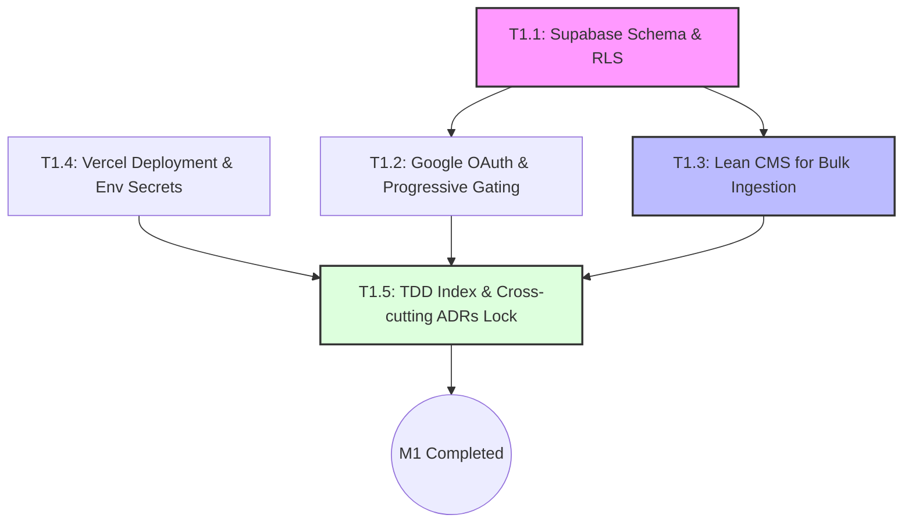

# Milestone Breakdown: M1 — Foundations (ArkaDex MVP)

This document provides the actionable phase-by-phase breakdown for each task in M1. It follows the **Multi-Track Solo Development** pattern, dispatching work across 6 specialized personas to ensure quality and documentation integrity.
- **Reference:** [roadmap_arkadex.md](../roadmap_arkadex.md) §M1 — milestone dashboard.

---

## 1. Dependency Graph & Critical Path

**Critical Path:** T1.1 → T1.4 (Immediate Priority) → T1.2 → T1.3 → T1.5
**Parallel Opportunities:** 
- T1.4 is prioritized post-T1.1 to establish the CI/CD baseline before auth integration.
- T1.2 and T1.3 will follow once the production environment is stable.

---

## 2. Persona Involvement Summary

| Persona | T1.1 | T1.2 | T1.3 | T1.4 | T1.5 | Role |
| :--- | :---: | :---: | :---: | :---: | :---: | :--- |
| **PM** | ●● | ●● | ●● | — | ● | Scope & Acceptance |
| **SA+Dev** | ●● | ●● | ●● | — | — | Design & Implementation |
| **QA** | ● | ● | ● | ● | — | Verification & Audit |
| **DevSecOps** | ●● | ●● | — | ●● | — | Infra & Security |
| **UX Designer** | — | — | ● | — | — | Admin UI & States |
| **Tech Writer** | ● | ● | ● | ● | ●● | Documentation & ADRs |

*(●● = Lead Persona, ● = Support/Single Phase)*

---

## 3. Task Breakdowns

### T1.1 — Implement Supabase Schema & RLS Policies
**Goal:** Establish secure multi-tenant data layer with encryption, RLS isolation, and audit trails.
**Total Effort:** 4 days | **Personas:** PM, DevSecOps, SA+Dev, QA, Tech Writer
**Status:** ✅ Completed + Addendum (Migration Pending)

| Phase | Persona | Duration | Input | Output | DoD & Handoff |
| :--- | :--- | :--- | :--- | :--- | :--- |
| **✅ 0. Scope Pre-Flight** | PM | 0.25d | PRD KR1-4, threat model sketch | Approval boundary document | Scope locked; unblock Phase A |
| **✅ A. Infra Provisioning** | DevSecOps | 0.5d | Approved scope, Supabase creds | `.env.local`, project init | Phase B ready for migrations |
| **✅ B. Schema Design** | SA+Dev | 1d | TDD ADR-001 draft, Env ready | `migrations/*.sql` committed | Peer review by DevSecOps |
| **✅ C. RLS Authoring** | DevSecOps | 1d | Schema applied, Phase B sign-off | `supabase/migrations/*_rls_policies.sql` | RLS isolation test suite ready |
| **✅ D. RLS Isolation Audit** | QA | 0.5d | Policies live, test DB seeded | Audit report (`docs/audits/rls_isolation_report.md`) | Phase E ready for TDD docs |
| **✅ E. ADR-002 Doc** | Tech Writer | 0.5d | Audit report, Schema DDL | `docs/adr/ADR-002-supabase-rls-strategy.md` | TDD section complete |
| **✅ F. DoD Audit** | PM | 0.25d | All phase outputs | T1.1 marked ✅ | Gate release to M1.2/1.3 |

**Start:** T+0 | **End:** T+4d

---

### T1.2 — Google OAuth & Progressive Gating
**Goal:** Wire Supabase Auth + Google OAuth, plus progressive gating (anonymous → authenticated → owner-only).
**Total Effort:** 3 days | **Personas:** PM, DevSecOps, SA+Dev, QA, Tech Writer
**Depends on:** T1.1
**Status:** ✅ Completed

| Phase | Persona | Duration | Input | Output | DoD & Handoff |
| :--- | :--- | :--- | :--- | :--- | :--- |
| **✅ 0. Scope Pre-Flight** | PM | 0.25d | PRD Auth requirements | Gating tiers definition | Tiers locked; unblock Phase A |
| **✅ A. Provider Config** | DevSecOps | 0.5d | Google Cloud OAuth credentials | Supabase Auth provider active | Secrets in Vercel/Local ready |
| **✅ B. Auth Middleware** | SA+Dev | 1d | Gating tiers, Phase A ready | Middleware guards + Session handler | Route protection verified locally |
| **✅ C. Hardening** | DevSecOps | 0.5d | Phase B implementation | Rate limiting & Brute-force protection | Security audit sign-off |
| **✅ D. E2E Auth Test** | QA | 0.5d | Auth flow live on staging | `tests/auth_flow.spec.ts` | Session edge cases verified |
| **✅ E. ADR-003 Doc** | Tech Writer | 0.25d | Flow design + Setup steps | `docs/adr/ADR-003-auth-strategy.md` | Setup runbook ready |
| **✅ F. UX Walkthrough** | PM | 0.25d | QA sign-off, live staging | T1.2 marked ✅ | Gating UX sign-off |

**Start:** T+4d | **End:** T+7d

---

### T1.3 — Lean CMS for Bulk Ingestion F-03 (Template A)
**Goal:** Build admin-only UI for bulk-import IDN sets via CSV/JSON; validate + commit to cards/sets tables.
**Status:** ✅ Completed (2026-05-16)

| Phase | Persona | Duration | Input | Output | DoD & Handoff |
| :--- | :--- | :--- | :--- | :--- | :--- |
| **✅ 0. Scope Pre-Flight** | PM | 0.25d | PRD KR4, Sample CSV/JSON | Validation rules & KR4 criteria | Input format locked |
| **✅ A. Admin UI Hi-Fi** | UX Designer | 0.75d | Scope, Design System tokens | Prototype: Import states (Loading/Error/Preview) | UI states locked for Dev |
| **✅ A+ Gate a Spec** | SA+Dev | — | Phase 0, Phase A | `docs/specs/F-03-lean-cms.md` | Feature spec Gate a locked |
| **✅ B. Ingestion Logic** | SA+Dev | 1d | Prototype, Validation rules | Parser + Validation service | Backend ingestion logic ready |
| **✅ C. Admin Protection** | SA+Dev | 0.5d | Phase B, T1.2 middleware | Admin-only route + RLS bypass | UI connected to Ingestion API |
| **✅ D. Ingestion Audit** | QA | 0.5d | Live CMS, 500-card test set | Ingestion report, Happy path pass | KR4 accuracy verified |
| **✅ E. ADR-004 Doc** | Tech Writer | 0.25d | Ingestion strategy | `docs/adr/ADR-004-ingestion-strategy.md` + `docs/ops/cms_ingestion_runbook.md` | ADR-004 Accepted; Runbook operational |
| **✅ F. PM Acceptance** | PM | 0.25d | ADR-004 + Runbook reviewed | T1.3 marked ✅ — Phase E sign-off complete | KR4 conditional pass carry-forward to pre-M2 |

**Start:** T+4d | **End:** T+7.5d (Parallel with T1.2)

---

### T1.4 — Vercel Deployment & Env Secrets (Template B)
**Goal:** Production-ready Vercel project + secret management (Supabase keys, OAuth secrets, etc.).
**Total Effort:** 1 day | **Personas:** DevSecOps, QA, Tech Writer
**Status:** ✅ Completed

| Phase | Persona | Input | Output | DoD |
| :--- | :--- | :--- | :--- | :--- |
| **✅ 0. Scope & Execute** | DevSecOps | Vercel Org access | Project init, Env vars, Custom domain | CI/CD pipeline green on staging |
| **✅ A. Verify** | QA | Deployed build | Smoke test deploy, Secret leak audit | No secrets in build logs; App reachable |
| **✅ B. Doc** | Tech Writer | Deployment setup | Deployment runbook & Rollback procedure | `docs/ops/deployment_runbook.md` |

**Start:** T+0 | **End:** T+1d

---

### T1.5 — TDD Index & Cross-cutting ADRs Lock (Template B)
**Goal:** Author cross-cutting ADRs and verify all ADRs (ADR-001..004) are linked and locked.
**Total Effort:** 0.5–1 day | **Personas:** Tech Writer, PM
**Depends on:** T1.1, T1.2, T1.3, T1.4

| Phase | Persona | Input | Output | DoD |
| :--- | :--- | :--- | :--- | :--- |
| **✅ 0. Scope & Execute** | Tech Writer | ADR-001..004 | ADR-005 (Auth Umbrella), ADR-006 (Deployment) | `docs/tdd_arkadex.md` index updated |
| **✅ A. Verify & Lock** | PM | `tdd_arkadex.md` | Final review of all TDD artifacts | ADRs status: Accepted/Locked |
| **✅ B. Doc Update** | Tech Writer | Roadmap file | Updated Roadmap §9 Cross-References | Roadmap links resolve correctly |

**Start:** T+7.5d | **End:** T+8.5d

---

## 4. T1.5 Phase A — PM Sign-Off

**Signed off by:** PM
**Date:** 2026-05-16

Phase A review complete. All six ADRs reviewed against the DoD criteria. Summary of findings:

**ADR-001 (Supabase Schema):** PASS — Metadata complete, decision unambiguous, consequences documented, cross-reference to ADR-002 present.

**ADR-002 (RLS Strategy):** PASS — Three-tier RLS model explicitly documented, positive and negative consequences present, cross-references to ADR-001 and audit report present.

**ADR-003 (Auth & Progressive Gating):** PASS — Eight sub-decisions documented with rationale, consequences with trade-offs complete, cross-references to all relevant specs, audits, and implementation files present.

**ADR-004 (Ingestion Strategy):** CORRECTED — Two lines contained inaccurate references to a non-existent `is_admin = true` database field, directly contradicting ADR-003 §5 and ADR-005 §3 (which are the authoritative sources for admin access control). Decision: correct the document, not add a "known discrepancy" note. Rationale: an ADR register that is being locked cannot carry an explicit internal contradiction as accepted state — the correction removes a false assertion about the implementation with no architectural change required. Two edits made: (1) Section 1.2 database bullet corrected to describe the actual `service_role` key mechanism; (2) Section 2.4.2 assertAdmin checklist — removed the `is_admin = true` database assertion. Correction footnoted in ADR-004 §5. Conditional-pass carry-forwards (KR4 audit, SEC/DI/PERF) remain open pre-M2 gates and do not affect M1 closure.

**ADR-005 (Auth Umbrella):** PASS — Multi-layer security model coherent with ADR-001 through ADR-004, consequences documented, cross-references complete.

**ADR-006 (Deployment):** PASS — Five sub-decisions explicit, positive and negative consequences documented, cross-references to auth and database ADRs present.

**TDD internal consistency:** Section 3 of `tdd_arkadex.md` previously labelled two inline design decisions as "ADR-001" and "ADR-002," conflicting with the canonical ADR register in Section 8 and the ADR files on disk. Corrected: those two entries are now labelled "Design Decision A" and "Design Decision B." Section 8 is the single authoritative ADR register.

**M1 Foundations:** All 5 tasks complete. ADR register locked. Conditional-pass items carried forward to pre-M2. M1 closed.
