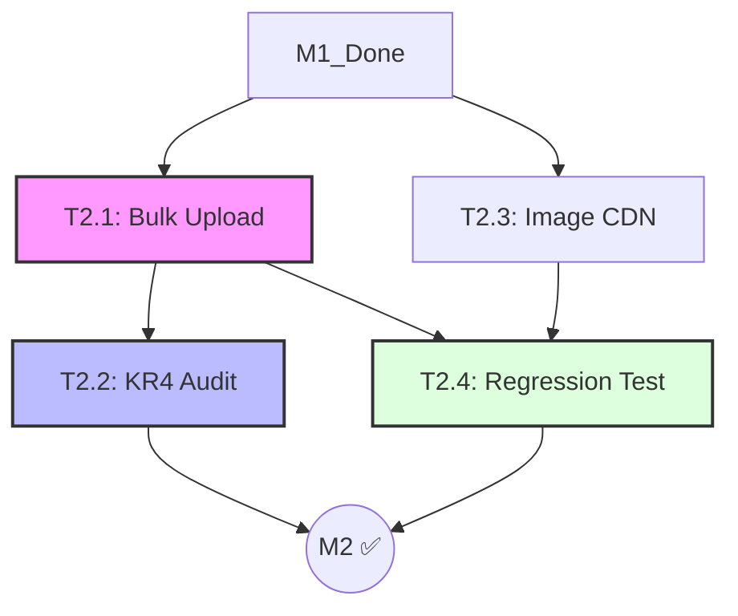

# Milestone Breakdown: M2 — Content (ArkaDex MVP)

This document provides the actionable phase-by-phase breakdown for each task in M2. It follows the **Multi-Track Solo Development** pattern, prioritizing data integrity (KR4) and performance (LCP).
- **Reference:** [roadmap_arkadex.md](../roadmap_arkadex.md) §M2 — milestone dashboard.

---

## 1. Dependency Graph & Critical Path

**Critical Path:** M1 → T2.1 → T2.4 → M2 ✅
**Parallel Opportunities:**
- **T2.3 ‖ T2.1**: Infrastructure setup for images can run parallel with content acquisition and CSV preparation.

---

## 2. Persona Involvement Summary

| Persona | T2.1 | T2.2 | T2.3 | T2.4 | Role |
| :--- | :---: | :---: | :---: | :---: | :--- |
| **PM** | ●● | ●● | — | ● | Scope & Acceptance (KR1, KR4) |
| **SA+Dev** | ●● | — | ● | ● | Content scripts + Image integration |
| **QA** | ● | ●● | ● | ●● | Audit + Regression test |
| **DevSecOps** | — | — | ●● | — | CDN/Storage provisioning |
| **Tech Writer** | ● | ● | ● | ●● | Ingestion log + Audit doc + Test plan |

*(●● = Lead Persona, ● = Support/Single Phase)*

---

## 3. Task Breakdowns (Template B — Lightweight)

### T2.1 — Bulk Upload 2 Recent IDN Expansions
**Goal:** Ingest 2 IDN expansion sets (most recent per PRD KR1) via Lean CMS; verify card count + image refs.
**Total Effort:** 1.5–2 days | **Personas:** PM, SA+Dev, QA, Tech Writer
**Depends on:** T1.3 (CMS live), T1.4 (Deploy)

| Phase | Persona | Input | Output | DoD |
| :--- | :--- | :--- | :--- | :--- |
| **1. Scope** | PM | PRD KR1, Public sources | Set selection (e.g. SV6, SV7), CSV templates | 2 target sets identified & source data acquired |
| **2. Execute** | SA+Dev | Templates, T1.3 CMS | Upload logs, Commit hash, DB records | Data visible in DB; image refs mapped |
| **3. Verify+Doc** | QA, Tech Writer | DB records, CMS logs | 10% spot-check report, M2 Ingestion Log | Spot-check passed; log entry added to runbook |

**Start:** T+0 | **End:** T+2d

---

### T2.2 — Manual Data Audit (KR4 Validation)
**Goal:** Validate ingested data accuracy against KR4 ("zero data-entry errors"); produce auditable report.
**Total Effort:** 1 day | **Personas:** PM, QA, Tech Writer
**Depends on:** T2.1 (Data ingested)

| Phase | Persona | Input | Output | DoD |
| :--- | :--- | :--- | :--- | :--- |
| **1. Scope** | PM, QA | KR4 criteria | Operationalization: 30 cards/set sample, Error categories | Audit strategy defined & sampling locked |
| **2. Execute** | QA | Sample list, Ground truth | Error log, Category distribution | Audit complete; all 60 cards verified |
| **3. Verify+Doc** | PM, Tech Writer | Error log | `docs/audits/kr4_audit_M2.md`, Sign-off | Final report archived; Error rate ≤ Threshold |

**Start:** T+2d | **End:** T+3d

---

### T2.3 — Setup Optimized Image Storage/CDN
**Goal:** Production image pipeline with target LCP < 2.5s.
**Total Effort:** 1.5–2 days | **Personas:** DevSecOps, SA+Dev, QA, Tech Writer
**Depends on:** T2.1, T1.4

| Phase | Persona | Input | Output | DoD |
| :--- | :--- | :--- | :--- | :--- |
| **1. Scope+Execute** | DevSecOps | Provider access | Bucket/CDN configured, CORS, Signed URLs | Storage path convention locked (/cards/{set}/{id}) |
| **2. Integration** | SA+Dev | CDN config, T2.1 records | `<Image>` component, Backfilled URLs | Optimized images loading on staging |
| **3. Verify+Doc** | QA, Tech Writer | Staging build | Lighthouse report (LCP < 2.5s), Updated runbook | Performance budget met; Ops docs updated |

**Start:** T+0 | **End:** T+2d

---

### T2.4 — Regression Test for Ingestion Workflow
**Goal:** E2E Playwright test validating ingestion pipeline remains green for future runs.
**Total Effort:** 1.5–2 days | **Personas:** QA, SA+Dev, Tech Writer
**Depends on:** T2.1, T2.3

| Phase | Persona | Input | Output | DoD |
| :--- | :--- | :--- | :--- | :--- |
| **1. Scope** | QA | ADR-004, KR4 categories | Regression scope (Happy path + 3 edge cases) | Test requirements locked |
| **2. Execute** | QA, SA+Dev | Playwright env | `tests/e2e/ingestion_regression.spec.ts` | Tests passing in CI; No flakiness |
| **3. Verify+Doc** | Tech Writer, PM | Test results | `docs/testing/ingestion_regression_plan.md` | Test plan archived; Linked as M3 merge-gate |

**Start:** T+2d | **End:** T+4d
