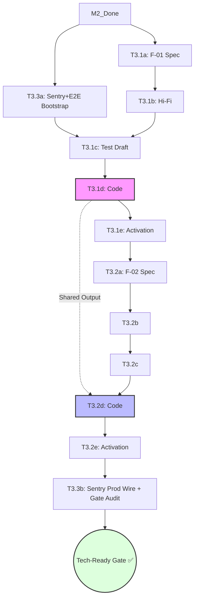

# Milestone Breakdown: M3 — Utility (ArkaDex MVP)

This document provides the actionable phase-by-phase breakdown for each task in M3. This is the final milestone of **Phase 1: Personal Alpha**, delivering the core "Digital Binder" experience and triggering the Tech-Ready Gate.
- **Reference:** [roadmap_arkadex.md](../roadmap_arkadex.md) §M3 — milestone dashboard.

---

## 1. Dependency Graph & Critical Path

**Critical Path:** M2 → T3.1 (a→e) → T3.2 (a→e) → T3.3b → Tech-Ready Gate ✅
**Parallel Opportunities:**
- **T3.3a ‖ T3.1a-b**: Infrastructure setup (DevSecOps) can run while Spec/UI for Binder Grid is being drafted.

---

## 2. Persona Involvement Summary

| Persona | T3.1 | T3.2 | T3.3 | Role |
| :--- | :---: | :---: | :---: | :--- |
| **PM** | ● | ● | ●● | Scope (KR3) + Tech-Ready Gate Audit |
| **SA+Dev** | ●● | ●● | ● | a/d-gate lead + Playwright bootstrap |
| **QA** | ●● | ●● | ●● | c/e-gate + E2E activation |
| **DevSecOps** | ● | ● | ●● | RLS verify + Sentry + Playwright infra |
| **UX Designer** | ●● | ●● | — | b-gate (Hi-Fi) lead + a11y check |
| **Tech Writer** | ● | ● | ●● | Changelog + Runbook + Guides |

*(●● = Lead Persona, ● = Support/Single Phase)*

---

## 3. Tech-Ready Gate Cross-Reference (Roadmap §7)

| §7 Checklist Item | Task ID | Verification Method |
| :--- | :--- | :--- |
| ≥ 2 IDN sets seeded | M2 (T2.1) | `SELECT count(*) FROM sets` ≥ 2 |
| ≥ 1 Master Set logged | T3.1 (Gate e) | Owner logs 1 complete set in Binder Grid |
| Zero data-entry errors | M2 (T2.2) | `docs/audits/kr4_audit_M2.md` Pass |
| RLS isolation test pass | T3.3 (Phase F) | Playwright RLS suite green |
| Playwright green | T3.3 (Phase D) | All CI test specs green |

---

## 4. Task Breakdowns

### T3.1 — F-01: Digital Binder Grid (Template C — Feature Hybrid)
**Goal:** Deliver primary responsive grid UX for browsing and tracking card collection.
**Total Effort:** 4–4.5 days | **Personas:** All 6 engaged
**Depends on:** M2 closed (Data + Images)

| Gate | Stage | Lead | Support | Artifact | DoD |
| :--- | :--- | :--- | :--- | :--- | :--- |
| **a** | Spec & TDD | SA+Dev | PM, Tech Writer | `docs/specs/F-01-binder-grid.md` | Spec DoD (7 items) |
| **b** | Hi-Fi Proto | UX Designer | SA+Dev | `prototypes/F-01/index.html` | Hi-Fi DoD (7 items) |
| **c** | Test Draft | QA | SA+Dev | `tests/e2e/F-01.spec.ts` (skip) | Test DoD (7 items) |
| **d** | Code | SA+Dev | DevSecOps, UX | Zustand store, Grid components | Renders all UI states |
| **e** | Activation | QA | UX, Tech Writer | Unskipped tests green | AC tests pass + A11y |

**Shared Output:** Zustand store (`stores/binder.ts`), `<Card>` component, and design tokens are passed to T3.2.

**Start:** T+0 | **End:** T+4.5d

---

### T3.2 — F-02: Quick-Add UI (Template C — Feature Hybrid)
**Goal:** Modal/drawer for rapid card entry from the Binder Grid context.
**Total Effort:** 3.5–4 days | **Personas:** 5 engaged
**Depends on:** T3.1 (Inherits store & components)

| Gate | Stage | Lead | Support | Artifact | DoD |
| :--- | :--- | :--- | :--- | :--- | :--- |
| **a** | Spec & TDD | SA+Dev | PM, Tech Writer | `docs/specs/F-02-quick-add.md` | Spec DoD (7 items) |
| **b** | Hi-Fi Proto | UX Designer | SA+Dev | `prototypes/F-02/index.html` | Hi-Fi DoD (7 items) |
| **c** | Test Draft | QA | SA+Dev | `tests/e2e/F-02.spec.ts` (skip) | Test DoD (7 items) |
| **d** | Code | SA+Dev | UX | Quick-Add modal + Mutation hooks | Latency < 500ms verified |
| **e** | Activation | QA | UX, Tech Writer | Unskipped tests green | PR merged to main |

**Start:** T+4.5d | **End:** T+8.5d

---

### T3.3 — Deploy Sentry & E2E Infrastructure (Template A — Split)
**Goal:** Production observability and final CI/CD validation gate.
**Total Effort:** 2–3 days | **Personas:** PM, DevSecOps, SA+Dev, QA, Tech Writer
**Depends on:** M2 closed; T3.3b depends on T3.1+T3.2 activation.

| Phase | Persona | Timing | Input | Output |
| :--- | :--- | :--- | :--- | :--- |
| **0. Scope** | PM | T+0 | PRD §5 Budget | SLOs & Alert thresholds |
| **A. Sentry SDK** | DevSecOps | T+0.5d | DSN credentials | Sentry active in staging |
| **B. Playwright** | SA+Dev/QA | T+1d | Vercel URL | CI bootstrap (T3.3a complete) |
| **C. Prod Wire** | DevSecOps | T+8d | T3.1/3.2 merged | Performance & Error monitoring |
| **D. E2E Sync** | QA | T+8.5d | Unskipped tests | CI matrix green; Merge-gate enabled |
| **E. Docs** | Tech Writer | T+9d | Implementation | `sentry_runbook.md`, `playwright_guide.md` |
| **F. Gate Audit** | PM | T+9.5d | All M3 outputs | **Tech-Ready Gate ✅** |

**Start:** T+0 | **End:** T+9.5d

---

## 5. Shared Infrastructure Handoff

T3.2 is optimized to reuse the foundation built in T3.1:
- **State Management**: T3.2 plugs directly into the `useBinderStore` created in T3.1.
- **Components**: The `<Card>` atom and grid styling tokens are reused to ensure visual parity.
- **Hooks**: Supabase mutation patterns from T3.1 are adapted for the Quick-Add feature.
