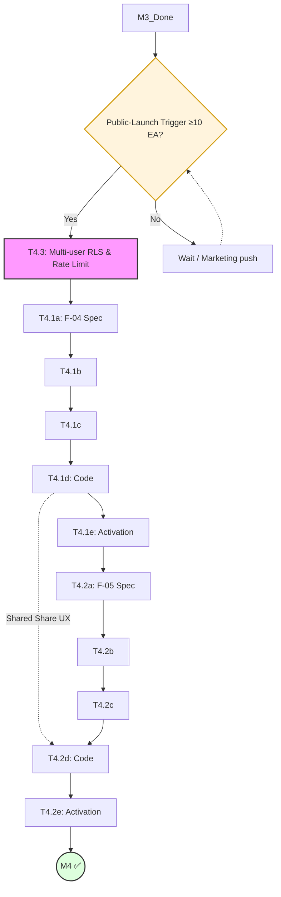

# Milestone Breakdown: M4 — Social Engine (ArkaDex MVP)

This document provides the actionable phase-by-phase breakdown for each task in M4. This is the first milestone of **Phase 2: Public Beta**, marking the transition from a personal utility to a community-facing platform.
- **Reference:** [roadmap_arkadex.md](../roadmap_arkadex.md) §M4 — milestone dashboard.

---

## 1. Dependency Graph & Critical Path

**Critical Path:** M3 → Trigger → T4.3 → T4.1 (a→e) → T4.2 (a→e) → M4 ✅
**Prerequisite:** The **Public-Launch Trigger** (≥10 Early Access requests) must be met before T4.3 Phase A begins.

---

## 2. Persona Involvement Summary

| Persona | T4.3 | T4.1 | T4.2 | Role |
| :--- | :---: | :---: | :---: | :--- |
| **PM** | ●● | ● | ● | Trigger Validation + Safety Gate |
| **SA+Dev** | ● | ●● | ●● | a/d-gate lead + Image gen backend |
| **QA** | ●● | ●● | ●● | Pen test + c/e-gate + Visual regression |
| **DevSecOps** | ●● | ● | ● | Rate limit infra + RLS hardening |
| **UX Designer** | — | ●● | ●● | b-gate Hi-Fi + Share UX pattern owner |
| **Tech Writer** | ● | ● | ●● | ADRs + Share user guides |

*(●● = Lead Persona, ● = Support/Single Phase)*

---

## 3. Public-Launch Trigger Handling (Roadmap §7)

T4.3 Phase 0 must validate the trigger status before proceeding to technical implementation.

| Trigger Status | Action |
| :--- | :--- |
| **≥ 10 EA requests** | Proceed to T4.3 Phase A. |
| **5–9 EA requests** | Pause M4; initiate 2-week marketing push; re-evaluate. |
| **< 5 EA requests** | Escalate to Kill/Pivot Criteria; consider scope reduction (e.g., skip F-05). |

---

## 4. Task Breakdowns

### T4.3 — Multi-user RLS Audit & Rate Limiting (Template A — Standard)
**Goal:** Harden multi-tenant isolation and provision rate limiting for social endpoints.
**Total Effort:** 2.5–3.5 days | **Personas:** PM, DevSecOps, SA+Dev, QA, Tech Writer
**Depends on:** M3 closed + Public-Launch Trigger met.

| Phase | Persona | Duration | Input | Output |
| :--- | :--- | :--- | :--- | :--- |
| **0. Scope** | PM | 0.25d | EA Waitlist status | Trigger validation memo, threat scope |
| **A. Rate Limit** | DevSecOps | 0.75d | Threat scope | Rate limit middleware + config |
| **B. Audit Script** | SA+Dev | 0.5d | RLS policies | `scripts/rls_multi_tenant_audit.ts` |
| **C. Pen Test** | QA | 0.75d | Audit script | Multi-tenant pen test report |
| **D. Tightening** | DevSecOps | 0.25d | Pen test findings | Updated RLS policies |
| **E. ADR-007** | Tech Writer | 0.25d | Implementation | `docs/adr/ADR-007-multi-tenant.md` |
| **F. Sign-off** | PM | 0.25d | All outputs | T4.3 marked ✅; M4 features unblocked |

**Start:** T+0 | **End:** T+3.5d

---

### T4.1 — F-04: WTB Text Export (Template C — Feature Hybrid)
**Goal:** Export "Want To Buy" lists in community-friendly text formats (emoji-rich).
**Total Effort:** 4 days | **Personas:** 5 engaged
**Depends on:** T4.3 ✅

| Gate | Stage | Lead | Support | Artifact | DoD |
| :--- | :--- | :--- | :--- | :--- | :--- |
| **a** | Spec & TDD | SA+Dev | PM, Tech Writer | `docs/specs/F-04-wtb-export.md` | Spec DoD (7 items) |
| **b** | Hi-Fi Proto | UX Designer | SA+Dev | `prototypes/F-04/index.html` | Hi-Fi DoD (7 items) |
| **c** | Test Draft | QA | SA+Dev | `tests/e2e/F-04.spec.ts` (skip) | Test DoD (7 items) |
| **d** | Code | SA+Dev | DevSecOps, UX | Text formatter + Clipboard util | Renders all UI states |
| **e** | Activation | QA | UX, Tech Writer | Unskipped tests green | AC tests pass + A11y |

**Start:** T+3.5d | **End:** T+7.5d

**Shared Output:** Share UX patterns (Modal, Clipboard helper, Deep-link util) are passed to T4.2.

---

### T4.2 — F-05: Flex Image Gen (Template C — Feature Hybrid)
**Goal:** Generate shareable "Flex" images (OG images) of the owner's collection.
**Total Effort:** 4.5–5 days | **Personas:** All 6 engaged
**Depends on:** T4.3 ✅, T4.1 (Share UX primitives)

| Gate | Stage | Lead | Support | Artifact | DoD |
| :--- | :--- | :--- | :--- | :--- | :--- |
| **a** | Spec & TDD | SA+Dev | PM, Tech Writer | `docs/specs/F-05-flex-gen.md` | ADR-008 Tech Choice |
| **b** | Hi-Fi Proto | UX Designer | SA+Dev | `prototypes/F-05/index.html` | 3 Image layouts locked |
| **c** | Test Draft | QA | SA+Dev | `tests/e2e/F-05.spec.ts` (skip) | Visual regression snapshots |
| **d** | Code | SA+Dev | DevSecOps, UX | `/api/og/flex` + Satori template | P95 latency < 3s |
| **e** | Activation | QA | UX, Tech Writer | OG previews verified | PR merged to main |

**Start:** T+7.5d | **End:** T+12.5d

---

## 5. Shared Share-UX Output Handoff

T4.2 inherits the "Share UX" foundation established in T4.1 to maintain consistency:
- **Share Modal**: The layout, customize toggles, and "Copy Link" buttons are reused.
- **Deep-linking**: The routing logic for public binder views is shared.
- **Rate Limiting**: Both features use the same middleware infrastructure provisioned in T4.3.
