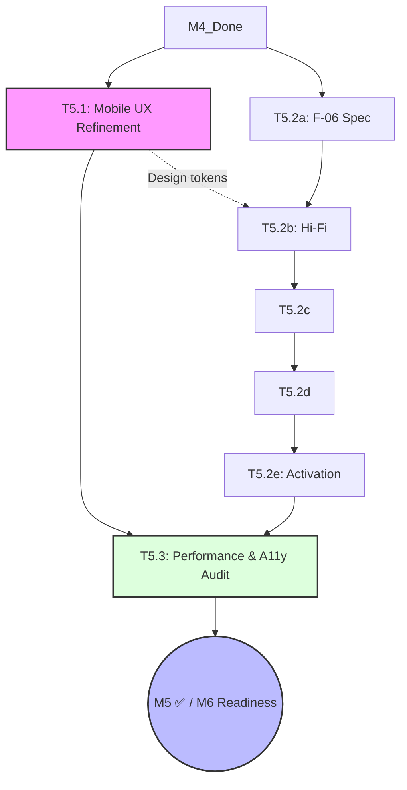

# Milestone Breakdown: M5 — Polish (ArkaDex MVP)

This document provides the actionable phase-by-phase breakdown for each task in M5. This is the final **Polish** milestone before the official launch, focusing on UX refinement, price references, and performance/accessibility audits.
- **Reference:** [roadmap_arkadex.md](../roadmap_arkadex.md) §M5 — milestone dashboard.

---

## 1. Dependency Graph & Critical Path

**Critical Path:** M4 → T5.2 (a→e) → T5.3 → M5 ✅
**Launch Gate:** M5 close triggers the **M6 Launch Readiness** checklist sign-off.

---

## 2. Persona Involvement Summary

| Persona | T5.1 | T5.2 | T5.3 | Role |
| :--- | :---: | :---: | :---: | :--- |
| **PM** | ● | ● | ●● | Scope + Launch Readiness Sign-off |
| **SA+Dev** | ● | ●● | ● | Implement UX + F-06 Backend + Perf Fixes |
| **QA** | ● | ●● | ●● | Visual Regression + Audit Lead |
| **DevSecOps** | — | ● | — | Rate limiting (if F-06 requires scraping) |
| **UX Designer** | ●● | ●● | ● | Design Lead + Hi-Fi F-06 + A11y Fixes |
| **Tech Writer** | ● | ● | ● | Changelog + ADR-009 + Audit Doc |

*(●● = Lead Persona, ● = Support/Single Phase)*

---

## 3. M6 Launch Readiness Cross-Reference

| Readiness Item | Verified By | Threshold |
| :--- | :--- | :--- |
| **LCP Performance** | T5.3 Phase 1 | < 2.5s on Mobile 4G |
| **API Latency** | T5.3 Phase 1 | P95 < 500ms |
| **WCAG AA Compliance** | T5.3 Phase 1 | Full pass (no critical violations) |
| **Visual Polish** | T5.1 Phase E | UX sign-off on glass/motion/contrast |
| **Price Data Integrity** | T5.2 Gate e | Tests green + manual spot-check |

---

## 4. Task Breakdowns

### T5.1 — Mobile UX Refinement (Template A — Standard)
**Goal:** Final visual and motion polish (glassmorphism, animations, WCAG contrast).
**Total Effort:** 2.5–3.5 days | **Personas:** UX Designer (Lead), SA+Dev, QA, Tech Writer
**Depends on:** M4 closed.

| Phase | Persona | Duration | Input | Output |
| :--- | :--- | :--- | :--- | :--- |
| **0. Scope** | PM + UX | 0.25d | Live UI | Scope memo: prioritizing polish items |
| **A. Token Audit** | UX Designer | 0.5d | Tailwind config | Token gap report (glass/motion/contrast) |
| **B. Visual Spec** | UX Designer | 0.75d | Token gap | Hi-Fi delta spec + CSS/Motion snippets |
| **C. Contrast** | UX + QA | 0.5d | Live UI | Contrast violation list (remediation plan) |
| **D. Implement** | SA+Dev | 1.25d | Specs/Fix list | Updated components + merged to staging |
| **E. Verify** | QA + UX | 0.25d | Staging build | Visual regression baseline update |
| **F. Doc** | Tech Writer | 0.25d | Implementation | `docs/design/design_tokens_v2.md` |

**Start:** T+0 | **End:** T+3.5d

---

### T5.2 — F-06: Price Reference (Template C — Feature Hybrid)
**Goal:** Display reference IDR prices for cards in the detail view.
**Total Effort:** 3.5–4 days | **Personas:** 5 engaged
**Depends on:** M4 closed + T5.1 Phase A (Tokens).

| Gate | Stage | Lead | Support | Artifact | DoD |
| :--- | :--- | :--- | :--- | :--- | :--- |
| **a** | Spec & TDD | SA+Dev | PM, Tech Writer | `docs/specs/F-06-price-ref.md` | ADR-009 Data Source |
| **b** | Hi-Fi Proto | UX Designer | SA+Dev | `prototypes/F-06/index.html` | Detail view variants locked |
| **c** | Test Draft | QA | SA+Dev | `tests/e2e/F-06.spec.ts` (skip) | Display + Stale data mocks |
| **d** | Code | SA+Dev | UX | Migration + Ingestion + UI Wiring | IDR formatting + Stale warning |
| **e** | Activation | QA | UX, Tech Writer | Unskipped tests green | PR merged to main |

**Start:** T+0 | **End:** T+4d

---

### T5.3 — Performance & A11y Audit (Template B — Lightweight)
**Goal:** Pre-launch technical audit for performance and accessibility.
**Total Effort:** 1.5–2 days | **Personas:** QA (Lead), SA+Dev, UX Designer
**Depends on:** T5.1 + T5.2 completed (UI stable).

| Phase | Persona | Lead | Duration | Output |
| :--- | :--- | :--- | :--- | :--- |
| **1. Execute** | QA + SA+Dev | QA | 0.75d | `docs/audits/m5_launch_audit.md` |
| **2. Remediation** | SA+Dev + UX | SA+Dev | 0.75d | Performance/A11y hotfixes applied |
| **3. Sign-off** | PM + Writer | PM | 0.25d | **M6 Launch Readiness Checklist** |

**Start:** T+4d | **End:** T+6d

---

## 5. Decision Support & Policy

### T5.2 Data Source Options (ADR-009)
- **Option 1: Manual Entry**: Owner enters prices manually per set/card (Low tech, high toil).
- **Option 2: Scrape**: Targeted scraping of community marketplaces (High tech, potential rate limit).
- **Option 3: Community**: Form for users to submit market prices (Community-driven).

### T5.3 Remediation Budget
- A maximum of **0.5 days** is allocated for "quick-win" remediations.
- If thresholds are still not met, PM must decide: **Ship with documented exception** OR **Delay M6 for deep optimization**.
