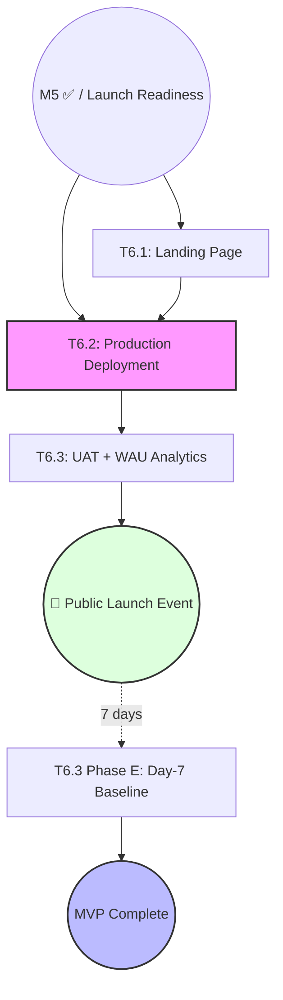

# Milestone Breakdown: M6 — Launch (ArkaDex MVP)

This document provides the actionable phase-by-phase breakdown for each task in M6. This is the final **Launch** milestone for the MVP, marking the transition to production and public accessibility.
- **Reference:** [roadmap_arkadex.md](../roadmap_arkadex.md) §M6 — milestone dashboard.

---

## 1. Dependency Graph & Critical Path

**Critical Path:** M5 → T6.1 → T6.2 → T6.3 → 🚀 Public Launch → MVP Complete
**Final Gate:** M6 completion marks the official end of the MVP roadmap.

---

## 2. Persona Involvement Summary

| Persona | T6.1 | T6.2 | T6.3 | Role |
| :--- | :---: | :---: | :---: | :--- |
| **PM** | ●● | — | ●● | Messaging + UAT Lead + Launch Sign-off |
| **SA+Dev** | ● | — | ● | Implement Landing + Analytics SDK + Fixes |
| **QA** | ● | ●● | ●● | Smoke Test + UAT Scripting + Analytics Verify |
| **DevSecOps** | — | ●● | ● | Production Cutover + Analytics Infra |
| **UX Designer** | ●● | — | ● | Landing Hi-Fi + UAT Observation |
| **Tech Writer** | ●● | ● | ●● | Copywriter + Runbook + Launch Reports |

*(●● = Lead Persona, ● = Support/Single Phase)*

---

## 3. Public Launch Event Definition (M6 ✅)

| Item | Verified By | Threshold |
| :--- | :--- | :--- |
| **Production URL** | T6.2 Phase 2 | Reachable, 99% uptime in 24h soak |
| **Landing Page** | T6.1 Phase D | Form working, LCP < 2.5s, SEO tags valid |
| **UAT Pass** | T6.3 Phase B | ≥ 4/5 users complete core scenarios |
| **Analytics Live** | T6.3 Phase D | 8–12 core events capturing in dashboard |
| **Rollback Plan** | T6.2 Phase 1 | Documented and tested in staging |

---

## 4. Task Breakdowns

### T6.1 — Landing Page (Template A — Standard)
**Goal:** Create the public-facing marketing surface with Early Access sign-up.
**Total Effort:** 2–3 days | **Personas:** PM (Lead), UX Designer, SA+Dev, QA, Tech Writer
**Depends on:** M5 closed.

| Phase | Persona | Duration | Input | Output |
| :--- | :--- | :--- | :--- | :--- |
| **0. Scope** | PM | 0.25d | Brand voice | Routing decision + value prop hierarchy |
| **A. Copy** | PM + Writer | 0.25d | Scope memo | Marketing copy (Hero/Features/FAQ) |
| **B. Hi-Fi** | UX Designer | 0.5d | Copy + Tokens | `prototypes/landing/index.html` |
| **C. Implement**| SA+Dev | 1d | Hi-Fi | Next.js page + EA Form endpoint |
| **D. Verify** | QA | 0.25d | Live URL | Smoke test + Lighthouse > 90 |
| **E. Assets** | Tech Writer | 0.25d | Live Page | Launch announcement drafts (Socials) |
| **F. Sign-off** | PM | 0.25d | All outputs | Landing ready for production traffic |

**Start:** T+0 | **End:** T+3d

---

### T6.2 — Production Deployment & Cutover (Template B — Lightweight)
**Goal:** DNS cutover and final production environment provisioning.
**Total Effort:** 1–2 days | **Personas:** DevSecOps (Lead), QA, Tech Writer
**Depends on:** M5 closed + T6.1 ready.

| Phase | Persona | Lead | Duration | Output |
| :--- | :--- | :--- | :--- | :--- |
| **1. Execute** | DevSecOps | DevSecOps | 1d | DNS Cut, SSL active, Rollback plan |
| **2. Verify** | QA | QA | 0.5d | 24h Soak + Smoke test across flows |
| **3. Doc** | Tech Writer | Writer | 0.25d | `docs/ops/production_runbook.md` |

**Start:** T+3d | **End:** T+5d

---

### T6.3 — UAT + WAU Instrumentation (Template A — Standard)
**Goal:** Real user validation and long-term usage tracking.
**Total Effort:** 2.5–3.5 days (core) | **Personas:** All 6 engaged
**Depends on:** T6.2 ✅ (Runs on production).

| Phase | Persona | Duration | Input | Output |
| :--- | :--- | :--- | :--- | :--- |
| **0. Scope** | PM | 0.25d | EA Waitlist | UAT scripts + Analytics event list |
| **A. Analytics**| SA+Dev/Ops | 0.5d | Event list | PostHog/SDK wired (ADR-010) |
| **B. UAT Run** | PM + QA | 1d | User batch | UAT findings (Friction/Bug log) |
| **C. Triage** | SA+Dev/UX | 0.5d | UAT findings | P0/P1 fixes applied to production |
| **D. Verify** | QA | 0.25d | Dashboard | WAU + Feature usage validated |
| **E. Day-7** | Tech Writer | 0.25d | Day-7 data | `docs/launch/day7_baseline.md` |
| **F. MVP Done** | PM | 0.25d | All outputs | **MVP Roadmap Complete 🏁** |

**Start:** T+5d | **End:** T+8.5d

---

## 5. Post-Launch Operations

### Rollback Trigger Policy
- Execute rollback if **P0 error rate > 1%** in first 4 hours of cutover.
- Execute rollback if **Early Access form** is broken for > 15 minutes.

### Post-Launch Iteration Signals
- **WAU > 50**: Proceed to "Growth" phase (referral loops, more social features).
- **WAU < 10**: Investigate acquisition funnel and value prop alignment.
