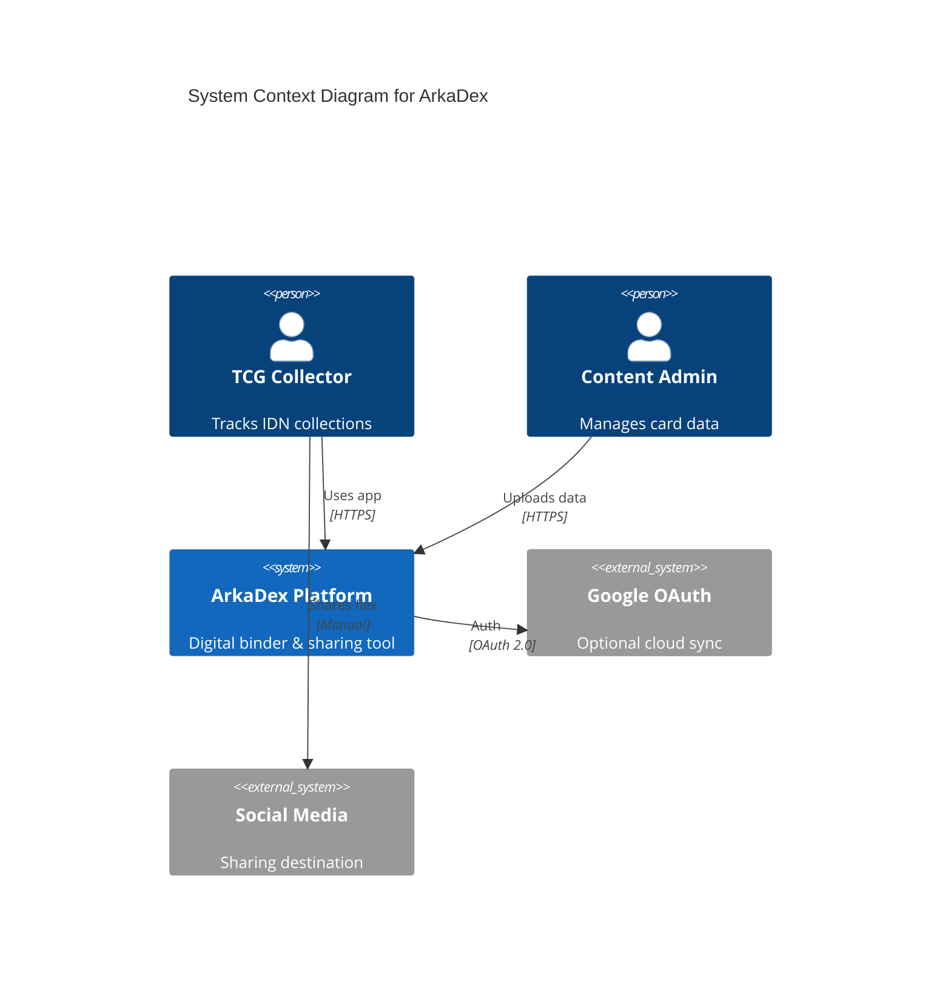
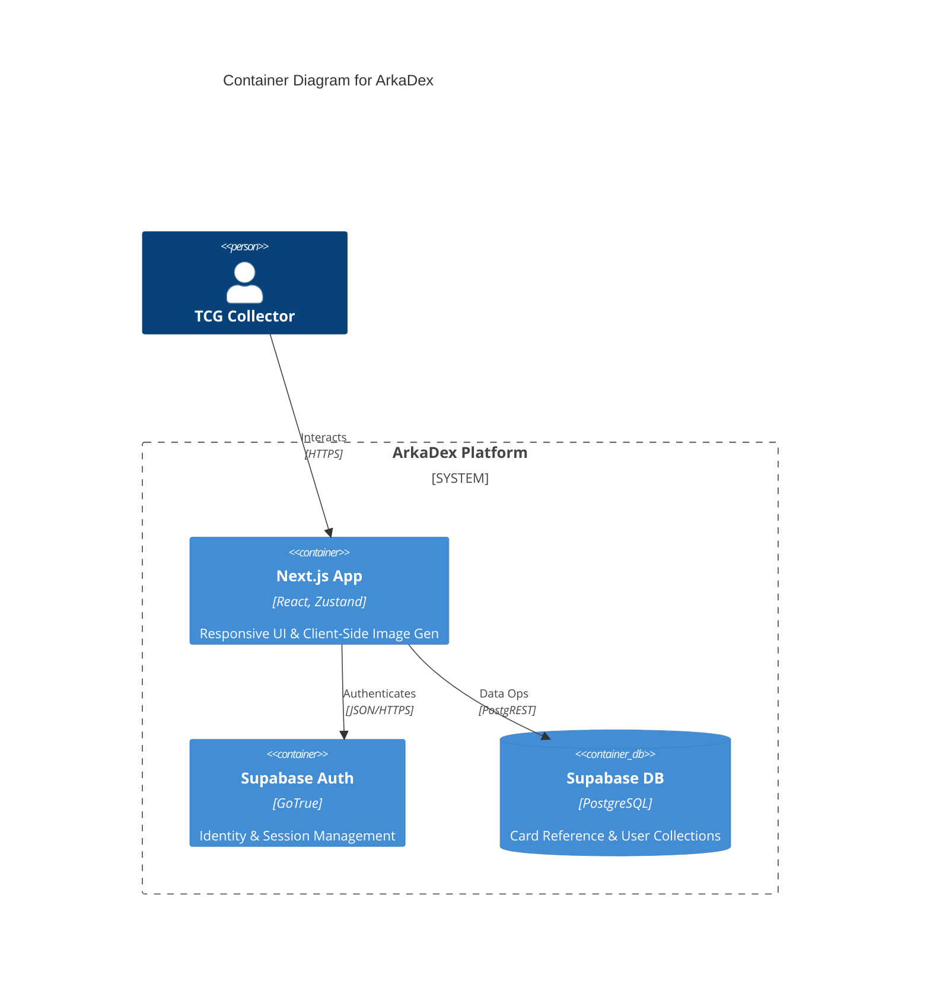
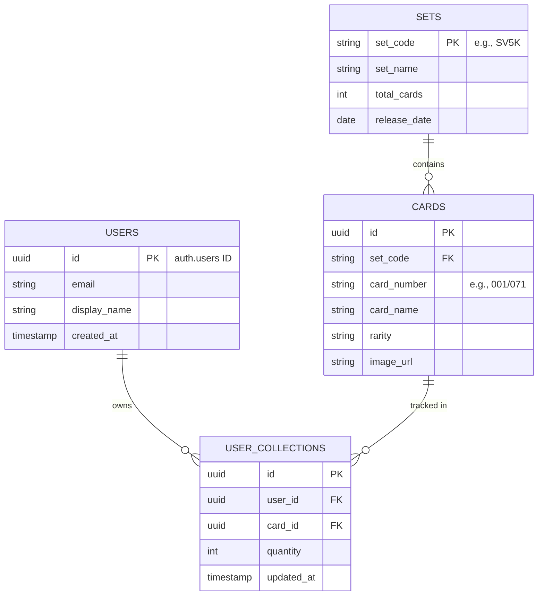

# Technical Design Document (TDD): ArkaDex MVP

| Metadata | Detail |
| :--- | :--- |
| **Document ID** | TDD-ARK-001 |
| **Status** | Approved for Development |
| **Version** | 1.0.0 |
| **Last Updated** | 2026-05-16 |
| **Audiences** | Backend/Frontend Engineers, SRE, QA |

---

## 1. Executive Summary
ArkaDex is a **Social Digital Binder** for the Indonesian Pokémon TCG community. It prioritizes **local set accuracy**, **inventory velocity**, and **social virality**.

> [!NOTE]
> This document outlines the technical implementation for the MVP, focusing on a client-side heavy architecture to minimize server overhead and maximize responsiveness.

### Core Principles
- **Client-Side Heavy**: Offload computation (image generation, collection state) to the browser.
- **Anonymous-First**: Enable full features without registration to lower entry friction and comply with **UU PDP** data minimization.
- **Pragmatic Velocity**: Choose tools that accelerate the "Time to Market" without sacrificing security or scalability.

---

## 2. System Architecture (C4 Model)

The platform follows a serverless-first approach using **Next.js 14+ (App Router)** and **Supabase**.

### 2.1 Context Diagram
High-level actors and boundaries.



### 2.2 Container Diagram
Technical building blocks and communication protocols.



---

## 3. Key Design Decisions (Early-Stage)

> [!NOTE]
> The two decisions below were captured during initial scoping before the formal ADR process was established. They are not numbered ADRs. The canonical ADR register is in **Section 8**. Full ADR files are linked there.

### Design Decision A: Anonymous-First Data Storage
**Context**: Target "Time-to-Log" is < 2 seconds. Privacy (UU PDP) requires zero PII collection for guests.

| Strategy | Pros | Cons |
| :--- | :--- | :--- |
| **Zustand + Persistence** | $0 cost, 0ms latency, 100% privacy | Data lost on cache clear |
| **Device ID Mapping** | Persistent guest data | Privacy concerns, DB cost |

**Decision**: **Zustand with `localStorage` persistence.**
> [!TIP]
> Use a "Soft CTA" to remind anonymous users to sync their data once their collection exceeds 50 cards to prevent data loss.

### Design Decision B: Client-Side Image Generation
**Context**: "Flex Image Gen" requires 9:16 social assets.

**Decision**: **`html-to-image` Library.**
- **Rationale**: Developing with React/Tailwind and converting to PNG is significantly faster than manual Canvas coordinate mapping.
- **Mitigation**: Assets are served from the same origin to avoid CORS-related canvas taint.

### ADR-003: Authentication & Progressive Gating Strategy
- **Decision**: Google OAuth only; three-tier progressive gating (Anonymous → Authenticated → Admin); server-side session via Supabase SSR; environment-based admin whitelist.
- **Key Points**:
  - Tier 1 (Anonymous): Read-only catalog access; collection in `localStorage`
  - Tier 2 (Authenticated): OAuth login; `localStorage` merge to `user_cards` (Verify-then-Clear)
  - Tier 3 (Admin): Email whitelist via `ADMIN_EMAIL_WHITELIST` env var only (not stored in DB)
  - PKCE callback with open-redirect guard (`startsWith('/')`)
  - `getUser()` in middleware (verified JWT, not `getSession()`)
- **Reference**: [ADR-003-auth-strategy.md](../adr/ADR-003-auth-strategy.md)

### ADR-004: Ingestion Strategy
**Context**: Internal team needs to ingest bulk TCG data (sets/cards) while maintaining data integrity (KR4).
**Decision**: **Two-stage validation (Client + Server) with Mandatory Dry-Run.**
- **Rationale**: Prevents data corruption; idempotent UPSERT allows safe retries.
- **Reference**: [ADR-004-ingestion-strategy.md](adr/ADR-004-ingestion-strategy.md)

### ADR-005: Cross-cutting Auth Umbrella
**Context**: Need a cohesive security boundary across Middleware, Server Actions, and Database.
**Decision**: **Multi-layered "Defense-in-Depth" Architecture.**
- **Rationale**: Combines `src/middleware.ts` (navigation), `assertAdmin()` (execution), and RLS (data) into a single verifiable model.
- **Reference**: [ADR-005-auth-umbrella.md](adr/ADR-005-auth-umbrella.md)

### ADR-006: Deployment & Environment Strategy
**Context**: Need stable hosting and secret management for M1 -> M2 transition.
**Decision**: **Vercel-Managed Infrastructure with Strict Variable Scoping.**
- **Rationale**: Automated CI/CD with Preview Deploys ensures production stability; encrypted env vars protect sensitive keys.
- **Reference**: [ADR-006-deployment.md](adr/ADR-006-deployment.md)

---

## 4. Data Model

The schema optimizes for the **One Card -> Many Users** relationship common in TCG binders.



---

## 5. Interface Contracts

### 5.1 Sync Anonymous Collection (RPC)
Synchronizes local state to the cloud after Google OAuth login.

| Parameter | Type | Required | Description |
| :--- | :--- | :--- | :--- |
| `local_collections` | array | Yes | Array of `{ card_id, quantity }` |

**Example Request:**
```json
{
  "local_collections": [
    { "card_id": "8482b43b-...", "quantity": 1 }
  ]
}
```

---

## 6. Workflows

### 6.1 Quick-Add Flow (F-02)
Optimistic updates provide immediate feedback.

1. **User Action**: Taps card in grid.
2. **Local Update**: Zustand updates state immediately (< 50ms feedback).
3. **Persist (Anon)**: Written to `localStorage`.
4. **Sync (Auth)**: Background PostgREST call to Supabase.

### 6.2 Flex Image Gen (F-04)
1. **User Action**: Clicks "Flex".
2. **Render**: Next.js renders a hidden high-res 9:16 layout.
3. **Capture**: `html-to-image` captures the DOM ref.
4. **Output**: Browser triggers download or Native Share API.

---

## 7. Performance & Security

### 7.1 Non-Functional Requirements (SLIs)

| Metric | Target | Implementation |
| :--- | :--- | :--- |
| **Response Time** | < 500ms P95 | Zustand Local State + Next.js Data Cache |
| **Viewport** | 360px (min) | Mobile-first Tailwind breakpoints |
| **Availability** | 99.9% | Supabase Serverless Architecture |

### 7.2 Security & Compliance (UU PDP)
- **Data Minimization**: No PII collected for guests; email scope only for Google OAuth.
- **RLS Enforcement**: 
  - `sets`/`cards`: `public` (Read-only).
  - `user_collections`: `auth.uid() == user_id` (CRUD).

> [!CAUTION]
> Ensure all Supabase client keys in the frontend are **Publishable Keys**; never expose Service Role keys in client-side code.

---

## 8. Architecture Decision Records (ADR Index)

| ADR | Title | Status | Date | Scope |
| :--- | :--- | :--- | :--- | :--- |
| [ADR-001](adr/ADR-001-supabase-schema.md) | Supabase Database Schema Design | Accepted | 2026-05-15 | T1.1 |
| [ADR-002](adr/ADR-002-supabase-rls-strategy.md) | Row Level Security Strategy | Accepted | 2026-05-15 | T1.1 |
| [ADR-003](adr/ADR-003-auth-strategy.md) | Authentication & Progressive Gating | Accepted | 2026-05-15 | T1.2 |
| [ADR-004](adr/ADR-004-ingestion-strategy.md) | Bulk Data Ingestion Strategy | Accepted | 2026-05-16 | T1.3 |
| [ADR-005](adr/ADR-005-auth-umbrella.md) | Cross-cutting Auth Umbrella | Accepted | 2026-05-16 | T1.1–T1.3 |
| [ADR-006](adr/ADR-006-deployment.md) | Deployment & Environment Strategy | Accepted | 2026-05-16 | T1.4 |

---

## 9. PM Sign-Off — T1.5 Phase A (M1 Foundations Lock)

**Signed off by:** PM
**Date:** 2026-05-16
**Task:** T1.5 Phase A — Verify & Lock All ADRs

All six ADRs (ADR-001 through ADR-006) have been reviewed against the T1.5 Phase A criteria: metadata completeness, unambiguous decision statements, positive and negative consequences, cross-references, English language, and cross-ADR consistency.

**Review results:**

| ADR | Result | Notes |
| :--- | :--- | :--- |
| ADR-001 — Supabase Schema Design | PASS | Metadata complete; decision explicit; consequences documented; cross-ref to ADR-002 present. |
| ADR-002 — RLS Strategy | PASS | Metadata complete; three-tier RLS strategy unambiguous; consequences documented; cross-ref to ADR-001 and audit report present. |
| ADR-003 — Auth & Progressive Gating | PASS | Metadata complete; 8 sub-decisions documented with full rationale; consequences with trade-offs present; cross-references to specs, audits, and key files complete. |
| ADR-004 — Bulk Ingestion Strategy | CORRECTED | Two lines contained inaccurate references to a non-existent `is_admin = true` DB field, contradicting ADR-003 §5 and ADR-005 §3. Corrected: (1) Section 1.2 database bullet updated to describe actual `service_role` key mechanism; (2) Section 2.4.2 removed the `is_admin = true` assertion bullet. No implementation change — documentation corrected to match deployed design. Correction noted in ADR-004 §5. |
| ADR-005 — Auth Umbrella | PASS | Metadata complete; integrates ADR-001–004 into a cohesive multi-layer security model; consequences documented; cross-references complete. |
| ADR-006 — Deployment Strategy | PASS | Metadata complete; decision explicit with 5 sub-decisions; consequences documented; cross-references complete. |

**TDD internal consistency correction:**
Section 3 of this document previously contained two inline entries labelled "ADR-001: Anonymous-First Data Storage" and "ADR-002: Client-Side Image Generation," which conflicted with the canonical ADR numbering in Section 8 and in the ADR files on disk. These entries have been relabelled "Design Decision A" and "Design Decision B" respectively. Section 8 remains the single authoritative ADR register.

**Conditional pass carry-forward:**
The two conditional-pass items from ADR-004 §3.2 (KR4 Manual Audit and Security/DI/PERF Gate e testing) remain open pre-M2 gates. They do not block M1 closure — they were accepted as carry-forwards during T1.3 Phase E sign-off and are tracked in ADR-004 §5 and `docs/ops/cms_ingestion_runbook.md` sections 6–7.

**M1 Foundations status:** All 5 tasks complete. ADRs locked. Ready for M2 — Content kick-off.
