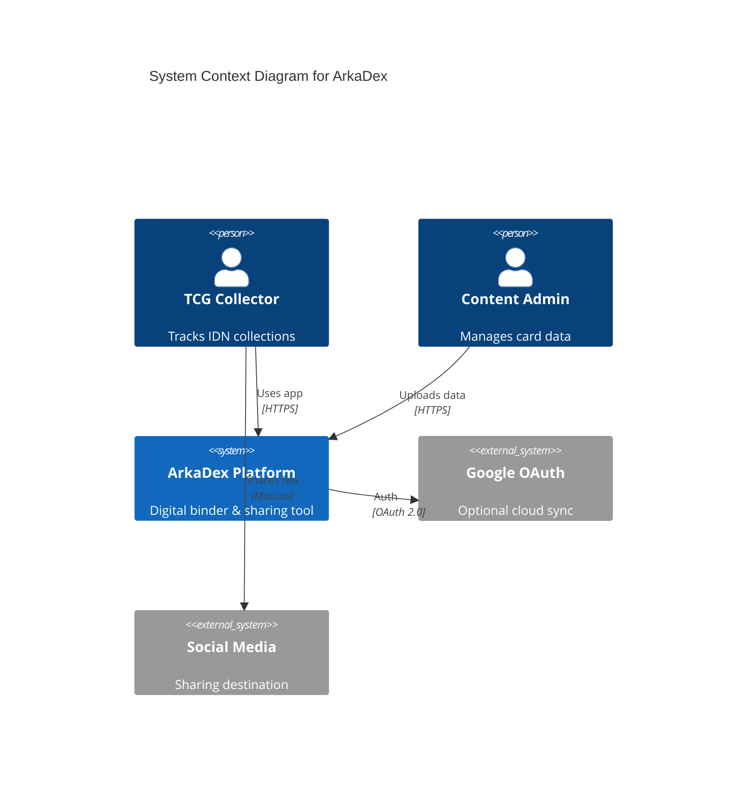
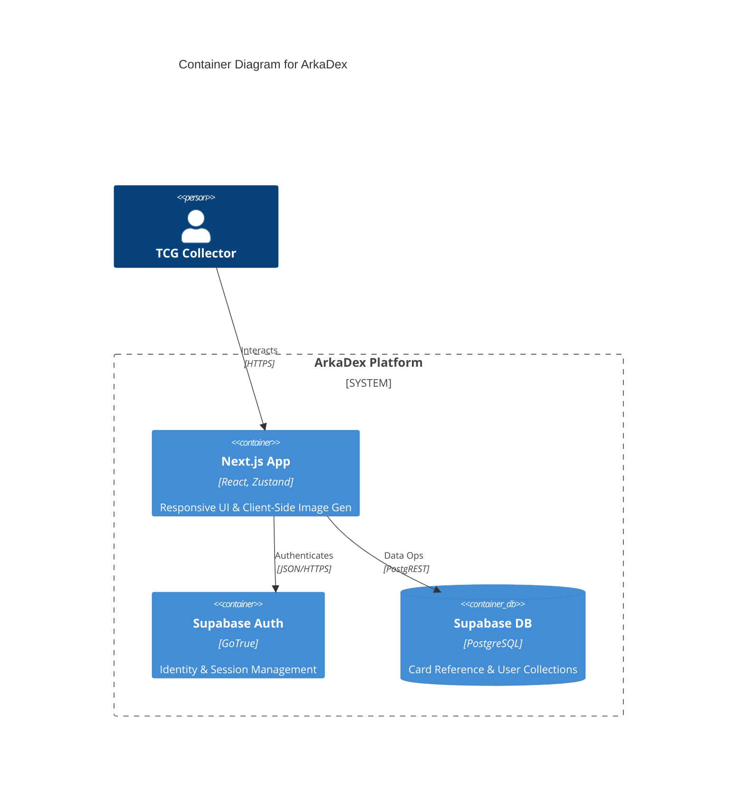
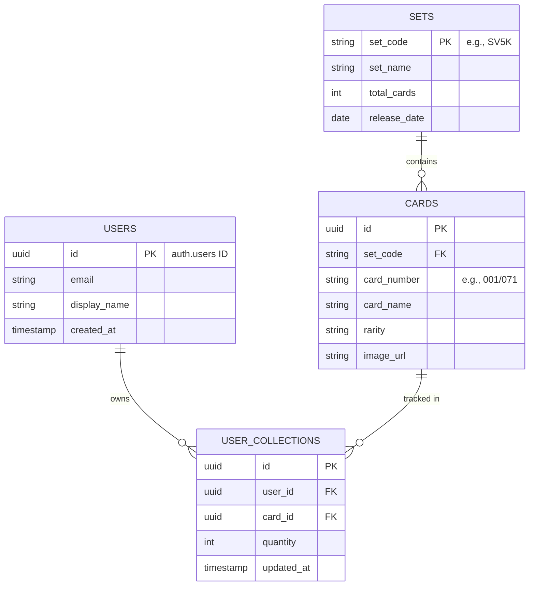

# Technical Design Document (TDD): ArkaDex MVP

| Metadata | Detail |
| :--- | :--- |
| **Document ID** | TDD-ARK-001 |
| **Status** | Approved for Development |
| **Version** | 1.0.0 |
| **Last Updated** | 2026-05-13 |
| **Audiences** | Backend/Frontend Engineers, SRE, QA |

---

## 1. Executive Summary
ArkaDex is a **Social Digital Binder** for the Indonesian Pokémon TCG community. It prioritizes **local set accuracy**, **inventory velocity**, and **social virality**.

> [!NOTE]
> This document outlines the technical implementation for the MVP, focusing on a client-side heavy architecture to minimize server overhead and maximize responsiveness.

### Core Principles
- **Client-Side Heavy**: Offload computation (image generation, collection state) to the browser.
- **Anonymous-First**: Enable full features without registration to lower entry friction and comply with **UU PDP** data minimization.
- **Pragmatic Velocity**: Choose tools that accelerate the "Time to Market" without sacrificing security or scalability.

---

## 2. System Architecture (C4 Model)

The platform follows a serverless-first approach using **Next.js 14+ (App Router)** and **Supabase**.

### 2.1 Context Diagram
High-level actors and boundaries.



### 2.2 Container Diagram
Technical building blocks and communication protocols.



---

## 3. Architecture Decision Records (ADR)

### ADR-001: Anonymous-First Data Storage
**Context**: Target "Time-to-Log" is < 2 seconds. Privacy (UU PDP) requires zero PII collection for guests.

| Strategy | Pros | Cons |
| :--- | :--- | :--- |
| **Zustand + Persistence** | $0 cost, 0ms latency, 100% privacy | Data lost on cache clear |
| **Device ID Mapping** | Persistent guest data | Privacy concerns, DB cost |

**Decision**: **Zustand with `localStorage` persistence.**
> [!TIP]
> Use a "Soft CTA" to remind anonymous users to sync their data once their collection exceeds 50 cards to prevent data loss.

### ADR-002: Client-Side Image Generation
**Context**: "Flex Image Gen" requires 9:16 social assets.

**Decision**: **`html-to-image` Library.**
- **Rationale**: Developing with React/Tailwind and converting to PNG is significantly faster than manual Canvas coordinate mapping.
- **Mitigation**: Assets are served from the same origin to avoid CORS-related canvas taint.

### ADR-003: Lean CMS Implementation
**Context**: Internal team needs to ingest bulk TCG data.

**Decision**: **Next.js Admin UI (`/admin/bulk-upload`)**.
- **Rationale**: Centralizes RBAC within the app and removes the need for data-entry staff to access the raw Supabase dashboard.

---

## 4. Database Schema

The schema optimizes for the **One Card -> Many Users** relationship common in TCG binders.



---

## 5. Interface Contracts

### 5.1 Sync Anonymous Collection (RPC)
Synchronizes local state to the cloud after Google OAuth login.

| Parameter | Type | Required | Description |
| :--- | :--- | :--- | :--- |
| `local_collections` | array | Yes | Array of `{ card_id, quantity }` |

**Example Request:**
```json
{
  "local_collections": [
    { "card_id": "8482b43b-...", "quantity": 1 }
  ]
}
```

---

## 6. Workflows

### 6.1 Quick-Add Flow (F-02)
Optimistic updates provide immediate feedback.

1. **User Action**: Taps card in grid.
2. **Local Update**: Zustand updates state immediately (< 50ms feedback).
3. **Persist (Anon)**: Written to `localStorage`.
4. **Sync (Auth)**: Background PostgREST call to Supabase.

### 6.2 Flex Image Gen (F-04)
1. **User Action**: Clicks "Flex".
2. **Render**: Next.js renders a hidden high-res 9:16 layout.
3. **Capture**: `html-to-image` captures the DOM ref.
4. **Output**: Browser triggers download or Native Share API.

---

## 7. Performance & Security

### 7.1 Non-Functional Requirements (SLIs)

| Metric | Target | Implementation |
| :--- | :--- | :--- |
| **Response Time** | < 500ms P95 | Zustand Local State + Next.js Data Cache |
| **Viewport** | 360px (min) | Mobile-first Tailwind breakpoints |
| **Availability** | 99.9% | Supabase Serverless Architecture |

### 7.2 Security & Compliance (UU PDP)
- **Data Minimization**: No PII collected for guests; email scope only for Google OAuth.
- **RLS Enforcement**: 
  - `sets`/`cards`: `public` (Read-only).
  - `user_collections`: `auth.uid() == user_id` (CRUD).

> [!CAUTION]
> Ensure all Supabase client keys in the frontend are **Publishable Keys**; never expose Service Role keys in client-side code.
